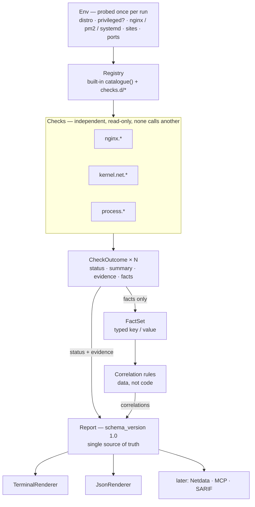
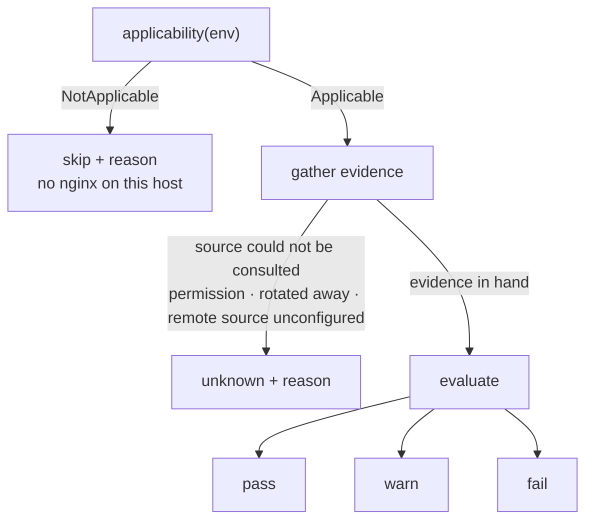

# whatbroke — architecture (v1)

A single-binary diagnostic CLI for servers. It inspects resources, kernel and
network limits, reverse-proxy configuration, process supervision, TLS, and
CDN-origin behaviour, then **reaches a conclusion** rather than printing
numbers.

v1 ships one thing: the CLI. The architecture below exists so that the surfaces
that come later — a Netdata plugin, an MCP tool, third-party checks — attach
without reopening the core.

---

## 1. Scope

### 1.1 In scope for v1

- A `whatbroke` binary that runs a catalogue of read-only checks and prints a verdict.
- A stable, versioned JSON report (`--json`).
- Extension seams for checks, correlation rules, evidence sources, and output
  surfaces (§3).

### 1.2 Explicitly out of scope for v1

| Not building | Why |
|---|---|
| Client/server, push protocol, central aggregator | Where fleet reach is needed, a Netdata Parent already provides it. Building a second one is duplicated transport with none of the maturity. |
| A metrics agent | Netdata, CloudWatch, and `sar` already record. This reads what they recorded. |
| A dashboard or web UI | A general observability tool must show everything because it cannot know what you are looking for. A diagnostic tool knows the question, so its output is a verdict. |
| Remediation | Every check is read-only. Findings carry remediation *text*, never actions. |

These are scope decisions, not permanent bans — but each one currently exists in
a better form elsewhere, and taking them on is how this turns into a worse
Netdata.

### 1.3 Why a CLI first

The unique value is diagnosis, and diagnosis is inherently on-demand: you run it
during or after an incident, once, and you want an answer. That shape is a CLI.

The distribution consequence matters as much as the technical one. `curl | sh`
and run has no standing cost — no install to maintain, no agent to supervise, no
resource footprint on a host whose resource exhaustion may be the thing under
investigation.

---

## 2. Concepts

Before the individual pieces, the shape of one run:



Three properties of that diagram are the architecture, and the rest of this
document is mostly their consequences:

- **`Env` sits upstream of everything** and is built exactly once (§3.2).
- **Evidence never reaches the rules.** Correlations consume the typed fact set;
  raw excerpts flow only into the report (§2.4). A check can rephrase its output
  without breaking a rule that depends on it.
- **Every renderer is downstream of the report** (§3.5). Nothing past the report
  computes a verdict, so two surfaces cannot disagree.

### 2.1 Check

The unit of diagnosis: self-contained, read-only, independently runnable.

Checks never call each other. Cross-check reasoning lives in §2.4, so that a
check stays a pure function from *evidence* to *verdict* and can be tested in
isolation.

### 2.2 Verdict: five states, not three

This is the decision that separates a diagnostic tool from a monitoring
threshold. Monitoring has `ok / warn / critical`. Diagnosis needs two more:

| Status | Meaning | Why it must exist |
|---|---|---|
| `pass` | Checked, healthy | |
| `warn` | Checked, risky | |
| `fail` | Checked, broken | |
| `skip` | Not applicable — no nginx on this host | Without it, "no findings" silently masquerades as "healthy" |
| `unknown` | Applicable, but undeterminable — needs root, log already rotated | The honesty state. A tool that cannot say "I could not tell" will eventually say something false |

`unknown` is load-bearing, not a fallback. Absence-of-evidence and
evidence-of-absence are different results, and a diagnostic tool that cannot
distinguish them will confidently mislead. Concretely: an empty nginx error log
during a 522 is *positive evidence* — it proves the requests never reached
nginx, which is what 522 means. The same empty log during a 520 is a *gap*,
because 520 evidence is supposed to be in that file. Same observation, opposite
meaning; the schema must be able to carry both.

Every `skip` and `unknown` carries a machine-readable reason, so a caller can
tell "this host has no nginx" from "I could not read the config".

The path to each state is mechanical:



The edge into `unknown` is about the *source*, not the *content*. A log that is
readable but empty is evidence: it goes right, into `evaluate`, where the check
decides what emptiness means — positive proof for a 522 check, a gap for a 520
one. Only a source that could not be consulted at all yields `unknown`.

### 2.3 Evidence

Every verdict carries what produced it: the command executed, the file and line
read, the raw excerpt, the parsed value.

Mandatory, not decorative, for two reasons:

1. A verdict without evidence is unactionable — the operator cannot confirm it.
2. When the consumer is an AI agent, evidence lets it reason past a wrong
   verdict instead of inheriting the mistake.

**Every piece of evidence records two independent things**, and collapsing them
into one is a bug that survives into every conclusion drawn from it:

```rust
pub struct Evidence {
    pub kind:      EvidenceKind,
    pub source:    String,          // file:line, command line, or URL
    pub excerpt:   Option<String>,  // the raw text read
    pub parsed:    Option<Value>,   // what the check made of it
    pub observer:  Observer,        // WHO looked
    pub authority: Authority,       // WHOSE data this is
}

pub enum EvidenceKind {
    Config, Command, Log, Probe, Error, OperatorInput,
}

pub enum Observer {
    Origin,     // measured on the host under diagnosis
    External,   // measured off-host
    Declared,   // nothing was measured; a person stated it (§3.11)
}

pub enum Authority {
    LocalHost,            // the host's own state: /proc, config, process table
    DirectProbe,          // a request that reached the origin without the edge
    CloudflareEdge,       // a response the edge itself produced
    CloudflareAnalytics,  // the edge's own records, queried after the fact
    OperatorDeclaration,  // business intent, not machine state (§3.11)
}
```

Both fields are **mandatory on every `Evidence`**, including operator input —
which is why `Declared` / `OperatorDeclaration` exist rather than an absent
field. `Observer::Declared` and `Authority::OperatorDeclaration` occur only
together; every pairing of the other two observers with the other four
authorities is legal. Serialized forms are the snake_case of the variant
(`origin`, `external`, `declared`; `local_host`, `direct_probe`,
`cloudflare_edge`, `cloudflare_analytics`, `operator_declaration`) and appear on
every evidence object in §4.

They are orthogonal. Running `curl https://site.example.com` **on the origin**
produces `observer = Origin` with `authority = CloudflareEdge`: the binary ran
on the host, but the response came from the edge. Querying the Cloudflare
Analytics API from that same host is `observer = Origin`,
`authority = CloudflareAnalytics` — data the origin never witnessed, fetched by
a process running on it.

Each dimension governs something different:

- **`observer` decides coverage.** Cloudflare is anycast, so a probe reaches the
  PoP nearest *the prober*. An origin-side probe covers the PoP nearest the
  origin, which is not the one visitors hit (§2.5).
- **`authority` decides what the data can be used to claim.** Only
  `CloudflareEdge` and `CloudflareAnalytics` can say what the edge returned;
  `LocalHost` cannot, however carefully it was measured.

Neither belongs to the run. One run routinely produces several of each:
`watch-52x.sh` already records an edge probe, a local probe and an upstream
probe on a single CSV row. Any design making either dimension a run-level mode
fails on its first real use case.

#### Vantage — the named pair a fact key can carry

Evidence records the two dimensions separately. A **fact key** cannot: a key is
a compile-time constant (§3.8) and a pair of enums is not a segment. So the
small set of pairs that actually occur is named, and that name — never the word
`observer` — is what appears in a key:

```rust
/// A named (observer, authority) pair. The only composite this document admits.
pub enum Vantage {
    OriginView,    // Observer::Origin        + Authority::CloudflareEdge
    ExternalView,  // Observer::External      + Authority::CloudflareEdge
    Analytics,     // either observer         + Authority::CloudflareAnalytics
    LocalView,     // Observer::Origin        + Authority::LocalHost | DirectProbe
    Declared,      // Observer::Declared      + Authority::OperatorDeclaration
}
```

Serialized: `origin_view`, `external_view`, `analytics`, `local_view`,
`declared`.

`Analytics` covers both observers on purpose, and this is not a shortcut: §2.5's
coverage table has the same row, because Analytics data describes every PoP
regardless of where the query was issued from. For the two `*_view` vantages the
observer is the whole point, and they stay distinct.

**A vantage is recorded, never declared.** It is derived from what actually
happened during the run — the same reason §6 refuses a `--vantage` flag. Naming
the pair makes it expressible in a key; it does not make it selectable.

**Operator input is evidence too.** Some conclusions rest on knowledge only a
person has — which endpoints are legitimately slow, whether the application
tolerates multiple processes (§3.11). Where a verdict rests on a declaration
rather than a measurement, that declaration appears in `evidence` with kind
`operator_input`, recording what was declared and where it came from. Otherwise
the report carries conclusions with no traceable origin, and a year later nobody
can tell whether "this endpoint is supposed to take 90s" was measured, inferred,
or typed once by someone who has since left.

### 2.4 Facts, scope, and correlations

Checks are independent; failures are not.

#### The host is not the unit of diagnosis

One machine routinely serves sites with nothing in common: `a.example.com`
behind Cloudflare proxying to Node, `admin.example.com` served directly,
`b.example.com` proxying to Go — sharing one nginx, one log directory, one
process supervisor. "This host has nginx, Node and Cloudflare" therefore
licenses **no** statement about any particular site. And since
`keepalive_timeout` and `proxy_read_timeout` can each be set at http, server or
location level, even the configuration under judgement differs per site.

So facts carry a scope:

```rust
pub struct Fact {
    pub key:   FactKey,      // still the closed registry of §3.8
    pub value: FactValue,
    pub scope: Scope,
}

/// *Runtime* scope — what one fact, outcome or finding belongs to.
/// Distinct from `ScopeKind` (§3.1), which is static metadata on the check.
/// Serialized with a discriminator so a consumer never has to probe for keys:
///   {"kind":"host"}
///   {"kind":"target","target":"t1","hostname":"a.example.com"}
pub enum Scope { Host, Target(TargetId) }

pub struct Target {
    pub id:       TargetId,
    pub hostname: Option<String>,        // server_name, where there is one
    pub server:   Option<ServerBlockId>, // the nginx server block
    pub upstream: Option<UpstreamId>,    // what it proxies to
}
```

The key stays a compile-time constant while the scope is runtime data. Encoding
the target into the key — `nginx.a_example_com.proxy_read_timeout` — would put
discovered strings inside a closed enumeration, which is a contradiction in
terms.

Memory, file descriptors and kernel counters are `Host`. Anything read from a
server block, an access log or an upstream — `proxy_read_timeout`, real-IP
configuration, the codes the edge returned, upstream restarts — is
`Target`-scoped. A report that cannot name *which hostname* is failing is not
actionable, and this is not new ground: `diag-52x.sh` already discovers sites
and audits proxy configuration per vhost. The model has to catch up with the
prototype, not the other way round.

#### Facts

A check may publish **facts** — small typed key/values — into the shared fact
set: `process.supervision.instance_count = 1` (scoped to a target),
`edge.cloudflare.origin_view.http.status_codes = [520, 522]` (scoped to a target),
`system.memory.is_under_pressure = true` (host).

**Correlation rules** then match over facts and check statuses to emit
higher-order findings:

```
edge.cloudflare.origin_view.http.status_codes ⊇ {520, 522}
  AND process.supervision.instance_count = 1    // pm2 fork, a single systemd unit,
                                            // a one-replica Deployment — same fact
  AND system.memory.is_under_pressure          // Host-scoped, visible to every target
  → "upstream is restarting under memory pressure"

edge.cloudflare.origin_view.http.status_codes ∋ 522  AND  kernel.net.listen_overflows_in_window > 0
  → "listen queue overflow, not a network fault"

edge.cloudflare.origin_view.http.status_codes ∋ 520  AND  nginx.error_log.entry_count_in_window == 0
  → 520-at-nginx ruled out; evidence points upstream

edge.cloudflare.origin_view.http.status_codes ∋ 520  AND  nginx.keepalive.timeout_seconds < 900
  → "origin closes idle connections before the edge stops reusing them"
```

Every rule above is evaluated **per target**, because each names at least one
target-scoped fact. `system.memory.is_under_pressure` participates as a constant:
host facts are visible from every target, never the reverse (§3.4).

That last rule is why a fact carries the code that was *observed* rather than
the code a cause is supposed to produce. Cloudflare's 900s Proxy Idle Timeout
returns **520**; **522** is what the edge reports when the origin refuses
keepalive outright. Both conditions point at `keepalive_timeout`, so a rule
firing on either code would prescribe the same change for two different
failures and be wrong about one of them. Predicating on the observed code keeps
the two apart — and is the difference between a diagnosis and a guess dressed
as one.

This is the layer no monitoring product has, and where the accumulated knowledge
in the current shell scripts actually lives. Correlations read *facts*, never
raw evidence strings, so a rule cannot break when a check changes how it phrases
its output.

### 2.5 Profiles

A check reports what is broken now. A correlation explains what several
observations mean together. Neither answers the question worth asking *before*
an incident: **given this stack, is the configuration known to be resilient?**

That is a profile — a set of assertions that apply when a particular combination
of software is present.

| Layer | Question | Highest verdict it may reach |
|---|---|---|
| Check | Is this thing broken right now? | `fail` |
| Correlation | What do these observations mean together? | `fail` (§3.4) |
| **Profile** | Does this stack have the configuration that prevents a known failure? | **`warn`** |

That ceiling is the whole point. A `keepalive_timeout` of 65s is not a failure —
the site may have served every request today without incident — it is a
configuration that will eventually produce 520s once a connection sits idle.
Reporting it as `fail` would redefine the exit code from "something is broken"
to "something is imperfect somewhere", and an exit code that cannot tell those
apart is one nobody wires into automation.

Two constraints follow from a profile being predictive rather than
observational.

**Activation is per target, not per host** (§2.4). One machine can serve
`a.example.com` through Cloudflare to a Node upstream while `admin.example.com`
is served directly; a host-level "Cloudflare and Node are present here" would
apply Cloudflare advice to a site that has never seen the edge. A profile is
evaluated once per target and reports its verdict — including
`NotApplicable` — for each of them.

**Activation must be proven, not assumed.** A profile firing on the wrong stack
gives confident advice about software the host is not running, and the operator
has no way to tell that this is what happened. Prevalence is not evidence:
"most sites are behind Cloudflare" is a fact about the population, not an
observation about this host.

Reading it from a local request's response headers is the specific trap — a
request to `127.0.0.1` never traverses the edge, so its headers prove nothing in
either direction. Evidence that does carry weight, by strength:

| Strength | Evidence | Why it is worth that much |
|---|---|---|
| Strong | Client IPs in the access log fall inside Cloudflare's current ranges | Traffic evidence: this host *is being* proxied, not merely configured for it once |
| Strong | `CF-Ray` observed by an external probe (§3.6 `Source`) | Unambiguous, but requires a probe |
| Strong | Operator declaration (§3.11) | |
| Moderate | `set_real_ip_from` lists Cloudflare ranges | Intent — possibly left from a migration years ago |
| Moderate | Firewall admits only Cloudflare ranges | Same |
| Weak | Authoritative DNS delegates to Cloudflare | May cover only some subdomains; `/etc/hosts` can mask it |
| None | Response headers of a request to `127.0.0.1` | Proves nothing either way |

One distinction decides whether this table is usable at all: **a request to
`127.0.0.1` never leaves the machine, while a request to the public hostname
does.** The former's headers say nothing about Cloudflare. The latter's `CF-Ray`
is hard evidence, because that request genuinely traversed the edge. Read
carelessly, the "None" row above discards one of the strongest signals
available; the rule is about the loopback path, not about response headers in
general.

One strong signal activates the profile; two moderate ones activate it. Below
that the profile does **not** simply become `skip { NotApplicable }`: positive
evidence that this site is served directly is `NotApplicable`, whereas evidence
too thin to decide either way is `unknown` (§3.10.1). "This site is not behind
Cloudflare" and "I could not tell" are the §2.2 distinction, and a profile that
collapses them gives an operator no way to know that the advice was withheld
rather than judged irrelevant.

**The log-based signal inverts, and an implementation that misses this will be
wrong on the best-configured hosts.** Where `set_real_ip_from` is correctly
set, nginx has already rewritten `$remote_addr` to the *visitor's* address, so
the log contains almost no Cloudflare IPs at all — the better the configuration,
the weaker this signal appears. A check reading it must use
`$realip_remote_addr`, which nginx keeps for the pre-rewrite address, or the
`CF-Connecting-IP` header where the log format records it, and otherwise fall
back to the moderate `set_real_ip_from` signal. Reading `$remote_addr` alone
concludes "not behind Cloudflare" precisely on the hosts that are set up
properly.

Three further constraints on that signal:

- **Count unique client IPs, not requests.** A single monitoring probe can
  contribute tens of thousands of requests from one address and dominate a ratio
  meant to describe the visitor population.
- **Only the extremes decide.** ≥95% inside Cloudflare's ranges activates; ≤5%
  rules it out; in between is `unknown` — and is itself a finding, since a site
  that is proxied *and* taking substantial direct traffic has most likely leaked
  its origin IP, which §7's `edge.cloudflare` domain already looks for.
- **Below a sample floor there is no ratio.** Under roughly 100 unique client
  IPs in the window the percentage is noise, and the signal degrades to
  `unknown` rather than answering confidently from a dozen addresses.

**No single probe covers a geographic failure.** Cloudflare is anycast, so a
probe reaches whichever PoP is nearest *the prober*:

| `observer` | `authority` | Coverage | Caveat |
|---|---|---|---|
| `Origin` | `CloudflareEdge` | the PoP nearest the origin | a saturated host distorts its own probe |
| `External` | `CloudflareEdge` | the PoP nearest the prober | closer to real visitors, still one point |
| `Origin` *or* `External` | `CloudflareAnalytics` | every PoP | authoritative, but delayed |

The last row is why the two dimensions are separate (§2.3): Analytics coverage
does not depend on where the query was issued from. Asking the API from the
origin returns the same all-PoP picture as asking from a laptop, while a *probe*
from those two places covers two different single points.

`External` is not an omniscient view — it is a *second* single point, merely one
closer to where visitors are. "522 only in some regions" cannot be settled by
one laptop running one probe; it takes several observers or the Analytics API. A check that concludes otherwise from a single external probe is
overreaching, and should say `unknown` about geography.

The range list is versioned data like any profile threshold (§3.10): a snapshot
ships with the binary carrying its `verified_on`, refreshes from
`cloudflare.com/ips-v4` when the network allows, and when it cannot be refreshed
the report states which snapshot was used. A diagnostic running during an outage
may well have no egress — here that is the normal case, not the edge case.

**Every threshold carries its provenance.** A profile is mostly third-party
constants, and third parties change them. Cloudflare's Proxy Read Timeout was
100s for years and is 125s today; the response-header cap was widely documented
as 32 KB and is now 128 KB in total. Both numbers were wrong in this project's
own scripts until they were checked against the vendor's current documentation.
An assertion therefore stores the URL it came from, the value as documented, and
the date that was last verified — and a verification date going stale is itself
something the tool can report, rather than a silent slide into giving advice
from a number nobody has looked at in two years.

### 2.6 Report

One versioned document is the single source of truth. Every output format is a
projection of it (§3.5). Nothing downstream may compute a verdict that is not
already in the report.

### 2.7 Normative vocabulary

Every term below is defined once, in the section named, and serialized exactly
as shown. The rest of this document explains *why* each is shaped the way it is;
this table is the lookup an implementer needs, and where the two ever disagree
this table is wrong and must be fixed rather than worked around.

| Term | Means | Serialized form | Defined in |
|---|---|---|---|
| `Status` | What a check, correlation or assertion concluded | `pass` `warn` `fail` `skip` `unknown` | §2.2 |
| `Severity` | Impact ordering, for display and sort only — **never** a verdict | `critical` `high` `medium` `low` `info` | §3.1 |
| `ScopeKind` | *Static*: what a check is scoped to | `host` `target` | §3.1 |
| `Scope` | *Runtime*: what one outcome or finding belongs to | `{"kind":"host"}` / `{"kind":"target","target":"t1","hostname":"…"}` | §2.4 |
| `Observer` | Who looked — decides **coverage** | `origin` `external` `declared` | §2.3 |
| `Authority` | Whose data it is — decides **what may be claimed** | `local_host` `direct_probe` `cloudflare_edge` `cloudflare_analytics` `operator_declaration` | §2.3 |
| `Vantage` | The named (observer, authority) pair a fact key may carry | `origin_view` `external_view` `analytics` `local_view` `declared` | §2.3 |
| `Domain` | Who *produces* evidence. May contain dots | `system` `kernel.net` `nginx` `process` `tls` `edge.cloudflare`, plus bundle-declared | §7 |
| `IncidentClass` | Presentation/selection tag; cuts across domains | `52x`, plus bundle-declared | §3.12 |
| `CheckId` | One check | `<domain>.<subject>_<predicate>` | §3.8 |
| `FactKey` | One published measurement | `<domain>[.<vantage>][.<subsystem>].<measure>` | §3.8 |
| `CorrelationId` | One higher-order finding | `<subject>.<what_is_happening>` | §3.8 |
| `AssertionId` | One assertion inside a profile | `<profile-id>/<assertion>` | §3.8 |
| `SignalId` | One activation signal inside a profile | `<profile-id>#<signal>` | §3.10 |
| `InputKey` | One operator declaration | a TOML path: `app.slow_endpoints` | §3.11 |
| `TargetId` | One discovered target, opaque and run-local | `t1` | §2.4 |
| `SkipReason` | Why a `skip` | `not_applicable` `source_unconfigured` `retired` | §3.1 |
| `UnknownReason` | Why an `unknown` | `permission_denied` `evidence_gone` `window_truncated` `timeout` `cancelled` `internal_error` `needs_input` `bundle_incompatible` | §3.1 |

Two pairs in that table are routinely confused, and each confusion has a
specific failure mode:

- **`Severity` is not `Status`.** A check declares the severity it *would* carry
  if it fired; the status is what it actually concluded. Severity orders output;
  it never reaches an exit code. §3.1 and §3.4 state this as a rule because the
  first draft of this document let a `critical` correlation imply `fail` without
  ever saying so.
- **`Observer` is not `Vantage`.** The first is one dimension of provenance on a
  piece of evidence; the second is a *named pair* of both dimensions, and exists
  only because a fact key needs one segment where evidence has two fields.
  A key segment is never called `observer`.

---

## 3. Extension model

Six axes, each designed so that extending along it requires no change to the
core.

| Axis | Extend by | Requires recompiling? |
|---|---|---|
| A. New check | Implement `Check`, register it | Yes (built-in) / No (bundle, §3.3) |
| B. New correlation | Add a rule | No — rules are data |
| C. New output surface | Implement `Renderer` | Yes, in the surface crate only |
| D. New evidence source | Implement `Source` | Yes, in `whatbroke-core` |
| E. New execution context | Supply a different `RunContext` | No |
| F. New incident playbook | Tag existing checks, rules and profiles, name the optional sources they need, add a grouping renderer (§3.12) | Yes, for the tag / No (bundle, §3.3) |

### 3.1 The `Check` trait

```rust
pub trait Check: Send + Sync {
    fn meta(&self) -> &CheckMeta;

    /// Decide whether this host is even a candidate. Returning
    /// `NotApplicable` yields a `skip` carrying the reason.
    fn applicability(&self, env: &Env) -> Applicability;

    /// Gather evidence and evaluate. Must be read-only and must poll
    /// `ctx.cancelled()` around anything slow.
    fn run(&self, ctx: &RunContext) -> CheckOutcome;
}

/// The single canonical definition. Every field a check carries is here; no
/// other section of this document may introduce another one.
pub struct CheckMeta {
    pub id: CheckId,          // "nginx.keepalive_below_idle_timeout"
    pub aliases: &'static [CheckId],  // former ids, still accepted (§3.8)
    pub title: &'static str,
    pub domain: Domain,       // system | kernel.net | nginx | process | tls | edge.cloudflare
    pub severity: Severity,   // severity IF it fires — display order, not a verdict
    pub refs: &'static [&'static str],
    pub explain: &'static str, // what it inspects, why it matters, how to fix
    pub incidents: &'static [IncidentClass],  // presentation/selection tag (§3.12)
    pub requires_observer: ObserverReq,       // execution precondition
    pub scope: ScopeKind,                     // Host or Target (§2.4)
}

/// Impact ordering. It sorts output and nothing else: no severity anywhere in
/// this document raises, lowers, or implies a `Status`, and none reaches the
/// exit code. The verdict is always carried by a `Status` (§3.4).
pub enum Severity { Critical, High, Medium, Low, Info }

/// *Static* scope — a property of the check, known before the run.
/// Distinct from `Scope` (§2.4), which is *runtime* and names the target.
pub enum ScopeKind { Host, Target }

/// A check's execution precondition — static metadata, distinct from the
/// `observer` recorded on each piece of evidence at runtime (§2.3).
pub enum ObserverReq {
    Origin,    // needs the host itself: /proc, config files, process table
    External,  // must run off-host; a binary on the origin cannot satisfy this
               // by passing a flag (§2.3)
    Either,    // e.g. TLS chain validation, from disk or from a handshake
}

pub enum Applicability {
    Applicable,
    NotApplicable { reason: SkipReason },
}

pub enum Status {
    Pass,
    Warn,
    Fail,
    Skip    { reason: SkipReason },
    Unknown { reason: UnknownReason },
}

/// Closed sets, not free text. §2.2 requires that a caller can tell "no nginx
/// here" from "I could not read the config" without parsing English, and §3.9
/// adds four more reasons the runtime itself produces.
pub enum SkipReason {
    NotApplicable,      // no nginx on this host
    SourceUnconfigured, // remote Source has no credentials (§3.6)
    Retired,            // withdrawn check, kept one release (§3.8)
}

/// `NeedsInput` is `unknown` and not one of the alternatives, each of which
/// fails differently: `skip` would claim the check does not apply when it does;
/// `pass` would record "I do not know" as "this is fine", the exact failure
/// §2.2 exists to prevent; `warn` would push an unproven concern into the exit
/// code. A sixth status would break §8.1's mapping for no gain. It carries an
/// `InputKey` rather than a bare marker so the report can say *what* to supply
/// — "I could not judge this" is not actionable, "declare which endpoints are
/// meant to run long" is.
pub enum UnknownReason {
    PermissionDenied,
    EvidenceGone,       // log rotated away entirely
    WindowTruncated,    // retained logs cover only part of --window (§3.9)
    Timeout,
    Cancelled,
    InternalError,      // the check panicked (§3.9)
    NeedsInput { key: InputKey },  // only a person can answer this (§3.11)
    BundleIncompatible,            // its bundle did not load (§3.3)
}

pub struct CheckOutcome {
    pub scope: Scope,              // which target this outcome is about (§2.4)
    pub status: Status,
    pub summary: String,
    pub evidence: Vec<Evidence>,
    pub facts: Vec<Fact>,          // published for correlations (§2.4)
    pub remediation: Option<String>,
}
```

**A check's `ScopeKind` decides how often it runs, and every outcome says which
target it is about.** The rule is exactly the one §3.4 already applies to
correlations, and there is no third case:

| `CheckMeta.scope` | Runs | Yields | `CheckOutcome.scope` |
|---|---|---|---|
| `Host` | once per run | one outcome | `Scope::Host` |
| `Target` | once per discovered target | **one outcome per target** | `Scope::Target(id)` |

So one target-scoped check produces one `checks[]` row per target (§4), each
carrying its own status, evidence and facts. A host-scoped check produces one
row with `scope: {"kind":"host"}`. Both always carry the field: a row whose
scope has to be inferred from whether the check *looks* per-site is a row a
renderer will eventually attach to the wrong virtual host, and on a box with
twenty vhosts that is not a rare accident.

`scope` is stamped by the runner from `RunContext`, never invented by the check;
an external check (§3.3) emits it on the wire and the runner rejects an outcome
whose scope is not the one it was invoked for.

`explain` lives on the check, not in prose, because the reference tables in the
current README are the most reused part of this project and prose drifts away
from the code it describes. `whatbroke explain <id>` reads this field.

### 3.2 The environment probe

`Env` is built once per run, before any check executes: OS and distro, whether
running as root, which of nginx / pm2 / systemd / sysstat are present, nginx
prefix and config paths, discovered sites and upstream ports.

It is a **capability snapshot, not an inventory**. The temptation in a
"what is on this machine" layer is to enumerate every installed package, which
turns a diagnosis into an asset audit: slow, permission-hungry, and mostly
irrelevant to why the edge returned 520. `Env` probes only what some check's
`applicability` or some profile's `applies_when` actually predicates on:

- OS, distro, architecture, and any container / cgroup limits
- privilege level, and whether systemd / nginx / pm2 / Node / docker / Netdata
  are present, with versions
- key config and log paths, listening ports, and one shared `nginx -T` snapshot

Every entry records where it came from and, when a probe failed, why. "pm2 is
not installed" and "pm2 is installed but could not be run" send a check to
`skip` and `unknown` respectively (§2.2); collapsing them here makes that
distinction unrecoverable downstream.

**`Env` is addressed by key, not by field access**, under the same discipline as
`FactKey` (§3.8): `EnvKey` is a closed registry of typed constants —
`env.nginx.is_present`, `env.nginx.version`, `env.privileged`,
`env.container.memory_limit_mb`. Profile activation predicates on `Env` (§3.10),
and a predicate cannot name something that only exists as a struct field in one
crate. Keys carry the `env.` prefix so no `Env` key can ever collide with a
published `FactKey`; `Env` entries are **not** facts and never appear in
`facts` (§4), because they describe the machine rather than any conclusion drawn
about it.

Where `Env` stops and §3.11 begins is not an arbitrary line: **`Env` measures
technical fact; the operator supplies business intent.** Whether Node is running
is measurable. Whether a 90-second endpoint is working as designed is not, and
no amount of probing will make it so. A check that finds itself inferring intent
from measurement — "this path is usually slow, so it is probably meant to be" —
has found the boundary and should be asking instead.

Building it once matters for correctness, not just speed: forty checks each
independently shelling out to `nginx -T` would produce forty possibly-different
views of the config within one run.

### 3.3 Registry, external checks, and bundles

Built-in checks are registered explicitly in one `catalogue()` function —
deterministic order, no macro magic, greppable.

#### Three words, three meanings

Earlier drafts used "plugin" for all of these, and installation paths,
ownership checks and CLI wording drifted apart accordingly. The words are fixed:

| Word | Means | Never means |
|---|---|---|
| **external check** | one executable speaking §3.3.1's protocol | the directory it lives in |
| **bundle** | one directory shipping any of the extensible kinds at once | a single executable; a fixture set (§3.6) |
| **plugin** | the Netdata `whatbroke.plugin` binary (§8.1), and nothing else | anything in this section |

"Plugin" is surrendered entirely to Netdata because Netdata already uses it for
an external executable, and the two meanings would collide in exactly the place
they meet. These are the terms used in CLI output, report fields and directory
names, not just in prose.

#### Discovery roots

For extension **without recompiling**, the registry accepts external checks and
bundles from **fixed roots**, resolved before anything is executed:

```
<root>/checks.d/*             a standalone external check  (§3.3.1)
<root>/bundles.d/<name>/      a bundle
```

```
bundles.d/mysql/
  manifest.toml        name, version, the schema versions it speaks, what it provides
  checks/*             external checks (§3.3.1)
  facts.toml           the fact keys it publishes, with declared types (§3.8)
  rules/*.toml         correlation rules (§3.4)
  profiles/*.toml      stack profiles (§3.10)
  playbooks/*.toml     incident tags over its own and existing checks (§3.12)
```

Which roots are consulted depends on privilege, and this is the whole of the
rule:

| Run as | Roots | Every path component must be |
|---|---|---|
| root | `/etc/whatbroke/` | owned by root, not group- or world-writable |
| an ordinary user | `/etc/whatbroke/`, then `$XDG_CONFIG_HOME/whatbroke/` | owned by root, or by the invoking user for the second root |

**A privileged run ignores `$XDG_CONFIG_HOME` precisely because it is an
environment variable the caller controls**, and a root process taking its
executable search path from a caller-controlled variable has handed out root.
The working directory is never a root at any privilege level. Where the same
name appears in both roots the system one wins, so a user root can add
capability but never shadow it.

The contract is deliberately the same shape as the internal trait, so an
external check is a first-class citizen: it appears in `whatbroke list`, it can
publish facts (registered keys match built-in correlation rules; `x.`-prefixed
keys are for user-supplied rules — §3.8), and it is subject to the same timeout
and cancellation. This is the extension path for site-specific
knowledge that will never belong upstream.

#### First-class by construction

**The CLI gains the capability without gaining code.** `run` executes the new
checks, `list` shows them with their applicability, `explain` answers for them,
`--domain mysql` and `--incident` filters work, and its rules and profiles
evaluate alongside the built-in ones — because every one of those commands walks
a registry rather than a hardcoded list. Nothing in `whatbroke-cli` changes when
a bundle is added, which is the property that makes this an extension model
rather than a fork point.

**Extending must never mean adding a verb.** The subcommand set — `run`,
`list`, `explain`, `capture` — is closed, and a bundle cannot add to it. A
bundle that ships its own verb ships its own output format and its own notion of
a verdict, and a dozen of those is precisely the situation this project exists
to replace: three shell scripts, three CSV layouts, no shared conclusion. New
capability arrives as checks, facts, rules, profiles and tags, all of which land
in the one report (§2.6).

#### Loading, trust, and degradation

**A bundle is executable code, and this process often runs as root.** Bundle
discovery therefore uses a **fixed root** — never the working directory, never a
path taken from an environment variable a caller controls — and every bundle is
ownership-checked before anything in it runs: when the process is privileged,
the bundle directory and its contents must be owned by root and must not be
group- or world-writable. Anything else is refused.

This is the same threat model as a shell script interpolating an attacker's
string into `eval`: a subject who can write one file that a root process later
executes has root. A bundle that fails the check is not loaded, and — following
the rule below — that refusal appears in the report rather than only on stderr,
because "these forty checks did not run" is a finding either way.

**Compatibility is a result, not a startup error.** A bundle whose declared
schema versions this build does not speak is *not* rejected on stderr and
forgotten: it appears in the report with its status, and every check it would
have contributed appears as `unknown { BundleIncompatible }`. A run that quietly
omits forty MySQL checks and prints a clean verdict has lied, whatever it wrote
to a terminal nobody was reading.

That requires **the manifest to be more stable than what it describes**. It
carries only a name, a version, the schema versions the bundle speaks, and —
critically — what it *provides*:

```toml
name    = "mysql"
version = "1.2.0"
speaks  = { check_protocol = "1", fact_schema = "1", rule_schema = "1" }
provides = { domains   = ["mysql"],
             incidents = ["replication"],
             checks    = ["mysql.replication_lag", "mysql.connection_saturation"] }
```

`provides` is what makes an incompatible bundle legible. Without it the core
knows something failed to load but cannot say what is now unchecked, and
"something is missing" is not a finding anyone can act on.

Degradation is **per kind, not per bundle**: rules and profiles are data and may
load while an incompatible check protocol keeps the executables out. The
consequence has to be tracked, though — checks that did not run publish no
facts, so rules depending on them become `unevaluated` rather than silently
false (§3.4).

**Why this shape and not dynamic loading.** Rust has no stable ABI, so
`dlopen`-ing a `cdylib` compiled by a different toolchain is unsound in
practice — panics across the boundary, mismatched allocators, and version skew
that surfaces as memory corruption rather than a clean error. The two mechanisms
here avoid the problem entirely: a process boundary needs no ABI, and
declarative data needs no code at all.

The cost is honest and bounded: a process boundary is unsuited to high-frequency
or high-volume exchange — a check that must stream 100 MB of log and hand
intermediate state to a built-in check belongs in the binary, compiled. Bundles
cover site-specific knowledge and whole new domains; they do not replace
built-in checks for hot paths.

#### 3.3.1 The external check protocol

`CheckOutcome` alone cannot carry a first-class check: it holds a verdict, not
an identity. Nothing in it says which check produced it, what domain it belongs
to, what `explain` should print, or which incidents it is tagged for — so a
registry built only on it could run an external check but never list, explain or
filter one, which is most of what §3.3 promises. The protocol therefore has two
modes, and the executable must implement both.

**Discovery — `describe`.** Invoked once per run, before any check executes. It
must not touch the host and must answer within 1s:

```
$ ./mysql-checks describe
{ "protocol": "1",
  "checks": [
    { "id": "mysql.replication_lag",
      "aliases": [],
      "title": "Replica is behind the primary",
      "domain": "mysql",
      "severity": "high",
      "scope": "target",
      "requires_observer": "origin",
      "incidents": ["replication"],
      "refs": ["https://dev.mysql.com/doc/..."],
      "explain": "Reads SHOW REPLICA STATUS ...",
      "publishes": [ { "key": "mysql.replication.lag_seconds", "type": "integer" } ] } ] }
```

Those fields are `CheckMeta` (§3.1) minus its Rust-isms, and the mapping is
one-to-one by construction: **if a field is added to `CheckMeta` it is added
here in the same change**, or external checks silently become second-class
again.

**Execution — `run`.** Invoked once per check, and once per target for a
target-scoped one. The request arrives on **stdin** so that argv stays free of
quoting hazards:

```
$ ./mysql-checks run
  ← stdin:  { "protocol": "1", "check": "mysql.replication_lag",
              "scope": { "kind": "target", "target": "t1", "hostname": "a.example.com" },
              "window": { "from": "...", "to": "..." },
              "privileged": false, "deadline_ms": 5000 }
  → stdout: { "protocol": "1", "check": "mysql.replication_lag",
              "scope": { "kind": "target", "target": "t1" },
              "status": "fail", "summary": "...",
              "evidence": [ ... ], "facts": [ ... ], "remediation": "..." }
```

The response repeats `check` and `scope` rather than letting the runner assume
them, and the runner **rejects a response whose scope is not the one it asked
about** (§3.1). An outcome silently attributed to the wrong vhost is worse than
no outcome.

The remaining semantics are stated so that two implementations cannot differ:

| Concern | Rule |
|---|---|
| stdout | protocol only — exactly one JSON document, nothing else |
| stderr | free-form; captured and attached as evidence when the check fails to answer |
| exit status | `0` with a parseable response, or the outcome is `unknown { internal_error }` with stderr as evidence (§3.9) |
| environment | sanitized; `WHATBROKE_PROTOCOL=1` is set, and nothing about the run is passed any other way |
| timeout | §3.9's per-check deadline, enforced on the process **group** |
| protocol version | `protocol` is a string, versioned independently of `schema_version` (§4), and a mismatch degrades exactly like an incompatible bundle |

**The manifest covers what `describe` cannot.** An incompatible bundle's
executables are never run, so `manifest.toml`'s `provides` block (above) carries
the same identities declaratively. `describe` is the authority when the bundle
loads; `provides` is what the report can still say when it does not. They
overlap on purpose, and the loader reports a bundle whose `describe` contradicts
its manifest rather than quietly picking a winner.

### 3.4 Correlation rules as data

```rust
pub struct CorrelationRule {
    pub id: CorrelationId,
    pub title: String,
    pub status: Status,            // Warn or Fail only — what firing contributes
    pub severity: Severity,        // display order only, never a verdict (§3.1)
    pub when: Vec<Predicate>,      // all must hold
    pub explanation: String,       // may interpolate matched facts
}

pub enum Predicate {
    Status  { check: CheckIdPattern, is: Vec<Status> },
    FactSet { key: FactKey, contains: FactValue },
    FactCmp { key: FactKey, op: CmpOp, value: FactValue },
    Not(Box<Predicate>),
}

/// Shared by every predicate language in this document — correlation rules,
/// assertions, and profile activation (§3.10.1) — so a rule author learns one
/// set of operators. Serialized as the lowercase name: `eq`, `gte`, `is_set`.
pub enum CmpOp { Eq, Ne, Lt, Lte, Gt, Gte, IsSet, Matches }
```

Because rules are data rather than conditionals, they can be loaded from file,
listed, unit-tested against synthetic fact sets, and reviewed by someone who is
not a Rust programmer. Adding institutional knowledge should not require a
compiler.

Being data, their evaluation has to be specified rather than left to emerge from
the order someone happened to write them in:

| Question | Decision | Why |
|---|---|---|
| Several rules match | **All fire** — not first-match-wins | One incident can have two true causes. Suppressing the second is how a diagnosis degrades into a guess |
| Output order | `severity` descending, then `id` lexicographically | Deterministic output is diffable between runs and testable against a golden file |
| May a rule read another rule's output? | **No.** One pass over the fact set | Chaining reintroduces ordering and cycles into what is meant to be declarative. A higher-order conclusion is a new rule over the same facts |
| May a rule change a check's status? | No | The check owns its verdict; a rule adds a finding beside it |
| A predicate's fact is **missing** | The predicate is `unknown`, not `false` | A fact is absent because the check that publishes it was skipped, timed out, or lives in a bundle that did not load (§3.3). Treating that as "the condition does not hold" makes the rule silently not fire, and a report that stays clean because evidence was never gathered is the §2.2 failure with extra steps |
| A rule with any `unknown` predicate | Reported as `unevaluated`, naming the missing keys | Silence would be indistinguishable from "checked and fine" |

**Evaluation is scoped.** A rule naming only host facts is evaluated once and
its finding carries `scope: Host`. A rule naming any target-scoped fact is
evaluated **once per target**, with host facts visible as constants, and each
finding carries the target it fired for. The visibility is deliberately
one-way — a target cannot see another target's facts, or one misconfigured
vhost would produce findings against its neighbours.

This is what makes a report answerable: "520s on `a.example.com`, whose upstream
is restarting" rather than "520s somewhere on this machine". It also multiplies
the work, which is the honest cost of being correct on a host with twenty
vhosts, and is why §3.9's concurrency limit governs targets as well as checks.

**Evaluation is three-valued (Kleene), and `Not` is where this bites.** Under
two-valued logic `Not(FactCmp { .. })` over an absent fact evaluates to `true`,
so a rule guarded by a negation fires on evidence nobody ever collected —
turning a missed finding into a fabricated one. `Not(unknown)` is `unknown`;
`unknown AND false` is `false` (the rule genuinely cannot hold); `unknown AND
true` is `unknown`. Anything simpler is wrong in a way that produces confident
output.

A correlation **may raise `summary.verdict`, never lower it**. Three independent
`warn`s that together mean the upstream is dying is precisely what this layer
exists to catch, and a conclusion that cannot move the exit code is one nobody's
automation will ever act on. The converse is forbidden: no rule may explain away
a `fail`.

**What a fired correlation contributes is its declared `status`, not its
severity.** This is the one roll-up rule, and every surface computes the verdict
the same way:

```
summary.verdict = worst( every check outcome's status,
                         every fired correlation's status,
                         every profile assertion's status capped at warn )
                  over the ordering  fail > warn > pass
```

`unknown` and `skip` never participate — they are counted, never rolled up
(§2.2) — and `unevaluated` (§4) contributes nothing at all, because nothing was
concluded.

`Severity` is deliberately absent from that expression. A `critical` correlation
does not imply `fail`; a rule that means "this run should fail" says
`status = fail` and says it in the rule file, where a reviewer can see it.
Deriving a verdict from a severity word would put the exit code at the mercy of
a display attribute, and the first person to relabel a rule `high` for cosmetic
reasons would silently change what the tool exits with. The two fields answer
different questions: `status` is *did this run fail*, `severity` is *what do I
look at first*.

`status` is restricted to `Warn` and `Fail`. A correlation exists to add a
finding; `pass` would be a rule that fires to announce nothing, and `skip` /
`unknown` are already carried by `unevaluated` when a predicate could not be
decided.

### 3.5 Renderers

```rust
pub trait Renderer {
    fn render(&self, report: &Report, out: &mut dyn Write) -> io::Result<()>;
}
```

v1 ships `TerminalRenderer` and `JsonRenderer`. Later surfaces — a Netdata
function table, an MCP tool result, SARIF — are additional implementations in
their own crates. **No check logic may live in a renderer**; a renderer that
computes a verdict is a bug, because it means two surfaces can disagree.

### 3.6 Evidence sources and the `HostAccess` seam

All filesystem and process access goes through one trait:

```rust
pub trait HostAccess: Send + Sync {
    fn read_file(&self, path: &Path) -> io::Result<String>;
    fn glob(&self, pattern: &str) -> io::Result<Vec<PathBuf>>;
    fn now(&self) -> DateTime<Utc>;

    /// Every execution carries its own deadline and cancellation. §3.9 requires
    /// a hung `nginx -T` to be killed at the 5s mark; a signature without them
    /// cannot express that, and adding them later means touching every call
    /// site in the catalogue.
    fn exec(&self, cmd: &Cmd, opts: ExecOptions<'_>) -> io::Result<Output>;

    /// A log plus its rotations, decompressed, narrowed to `window` and
    /// ordered by event time. Rotation and compression are environment
    /// concerns, never check concerns (§3.9).
    fn read_rotated(&self, path: &Path, window: TimeWindow) -> io::Result<LogSlice>;
}

pub struct LogSlice {
    pub lines: Vec<LogLine>,
    pub covered: TimeWindow,    // what was actually available; may be narrower
    pub sources: Vec<PathBuf>,  // which files were read, recorded as evidence
}

pub struct ExecOptions<'a> {
    pub deadline: Instant,
    pub cancel:   &'a CancelToken,
}
```

Two obligations come with `ExecOptions`, and neither is optional for
`LiveHost`:

- **The child starts in its own process group, and the deadline signals the
  group** — `SIGTERM`, then `SIGKILL` after a grace period. Signalling only the
  direct child leaves whatever it spawned still running and still holding the
  pipe, which is how a "timeout" turns into a hang anyway.
- **Timing out is not an error the check invents a verdict for.** It surfaces as
  `UnknownReason::Timeout` (§3.1), so a slow host cannot read as a broken one.

`FixtureHost` ignores `deadline` — replaying a recording takes no time — but
must still honour `cancel`, or the cancellation path in §3.9 has no test.

`read_file` and `glob` deliberately take no deadline. `exec` is the only call
that spawns something capable of hanging indefinitely; a pathological read is
covered by the whole-run budget instead. That is a deliberate asymmetry, not an
oversight — if a `/proc` read is ever observed to block in practice, it gets the
same treatment rather than a second mechanism.

`LogSlice::covered` is the reason rotation lives behind the trait rather than in
a helper: a check cannot report honestly about a window it did not fully see
unless the layer that read the files tells it what it got.

`LiveHost` in production; `FixtureHost` in tests, backed by recorded
`/proc` contents, `nginx -T` dumps, and log excerpts.

This seam is not academic. The predecessor shell scripts carry an explicit
caveat that they were never run end-to-end on a real Linux server, because the
development machine is macOS with no nginx, pm2, or `/proc`. A fixture-backed
`HostAccess` is what turns that permanent caveat into a test suite that runs
anywhere.

Remote evidence sources (the Cloudflare GraphQL Analytics API, a Netdata query
endpoint) implement a parallel `Source` abstraction with the same testability
property, and are always optional: a check whose remote source is unconfigured
returns `skip`, never `fail`.

#### Fixtures

A seam is worth exactly what its fixtures cover, so recording them is a shipped
capability rather than a test-time afterthought:

```bash
whatbroke capture --out fixtures/nginx-keepalive-65
```

`capture` runs the normal catalogue against `LiveHost` and records every read,
glob and exec into a **fixture set** — never called a bundle (§3.3):

```
fixtures/nginx-keepalive-65/
  manifest.toml           distro, kernel, privileged?, capture time, tool version
  fs/etc/nginx/nginx.conf
  fs/proc/net/netstat
  exec/nginx_-T.stdout    exit status and stderr recorded alongside
  exec/ss_-lnt.stdout
```

Three rules keep the fixtures honest:

- **A `FixtureHost` miss fails the test; it never returns an empty result.**
  Reading a path the fixture set does not contain panics with that path. Silently
  answering "not found" would let a check pass its tests by reading nothing at
  all — §2.2's false-healthy failure, reproduced inside the test suite.
- **Every check ships at least three fixtures**: one where it fires, one where it
  does not, and one where its evidence is unreadable — so the `unknown` path is
  exercised as deliberately as the other two.
- **Capture redacts on write.** Access logs carry client IPs and hostnames.
  `capture` maps them through a stable pseudonymiser — identical input to
  identical output *within* a fixture set, so log-correlation checks still work —
  and records in the manifest that it ran. A fixture set that cannot be shared is
  one that will not be committed, and an uncommitted fixture protects nothing.

### 3.7 `RunContext` — designing for execution models v1 does not have

```rust
pub struct RunContext<'a> {
    pub env: &'a Env,
    pub host: &'a dyn HostAccess,
    pub target: Option<&'a Target>, // Some for a Target-scoped check (§3.1), None for Host
    pub window: TimeWindow,         // for log/history analysis
    pub cancel: &'a CancelToken,
    pub progress: &'a dyn ProgressSink,
}
```

`target` is `Some` exactly when `CheckMeta.scope` is `Target`, and the runner
guarantees it: a target-scoped check that had to rediscover which vhost it was
looking at would re-derive, forty times over, the discovery `Env` already did
once — and would be free to disagree with it.

The CLI never cancels anything and reports progress to `/dev/null`. Both are in
the signature from day one anyway, because the surfaces on the roadmap need
them: a Netdata function can be cancelled mid-run when the user navigates away,
and must report progress to keep its timeout alive.

Retrofitting cooperative cancellation into a catalogue of forty checks later is
not an extension, it is a rewrite of all forty. The seam costs almost nothing
now and cannot be added cheaply later.

### 3.8 Stability contracts

Three names in this design are read by things the compiler cannot reach: JSON
consumers, external checks, rule files, operators' one-liners. They are public
contracts from the first release, and treating them as internal details is a
cost paid entirely by other people.

#### Check IDs

Format `<domain>.<subject>_<predicate>`, lowercase —
`nginx.keepalive_below_idle_timeout`, `kernel.net.listen_queue_overflowing`.

An ID appears in the report, in `explain <id>`, in `--check` globs, in
correlation predicates, and in external check output. So:

- **Renaming is additive.** The new ID ships while the old one stays in
  `CheckMeta.aliases`. The report always emits the canonical ID; `--check` and
  rules accept either; the alias survives at least one minor release.
- **Retiring is staged.** A withdrawn check first becomes
  `skip { reason: "retired" }` for one release, then disappears. A check that
  simply vanishes makes every rule and script naming it quietly stop applying,
  which on a terminal reads exactly like "nothing is wrong".

#### Identifier shapes

Three kinds of identifier share this document and a reader must be able to tell
them apart without context. They have distinct shapes, and the shapes are
normative:

| Kind | Shape | Example |
|---|---|---|
| **Fact key** | `<domain>[.<vantage>][.<subsystem>].<measure>` — dot-separated nouns, last segment carrying a unit or type suffix | `nginx.keepalive.timeout_seconds` |
| **Check id** | `<domain>.<subject>_<predicate>` — one judgement inside one domain | `nginx.keepalive_below_idle_timeout` |
| **Correlation id** | `<conclusion-subject>.<what_is_happening>` — the first segment names *what the finding is about*, drawn from a different vocabulary than `Domain` | `upstream.restarting_under_memory_pressure` |
| **Assertion id** | `<profile-id>/<assertion>` — a slash, never a dot, because an assertion only exists inside its profile | `cloudflare-nginx-node/keepalive_above_idle_timeout` |
| **Signal id** | `<profile-id>#<signal>` — a hash, so an activation signal is never read as an assertion (§3.10.1) | `cloudflare-nginx-node#access_log_client_ips_in_cf_ranges` |

Before this rule those three were `nginx.keepalive.seconds`,
`nginx.keepalive_below_cf_window` and `nginx.keepalive_above_idle_timeout` — a
fact, a check and an assertion, indistinguishable at a glance, in a document
where all three appear within a few paragraphs of each other.

**Roles, not segment counts.** A `Domain` is a registered name and some
registered names contain dots — `kernel.net`, `edge.cloudflare` (§7). A check in
one of those has more than two dot-separated segments, so any rule phrased as
"two segments" rejects ids this document itself declares valid:

```
nginx.keepalive_below_idle_timeout    domain nginx           · subject_predicate
kernel.net.listen_queue_overflowing   domain kernel.net      · subject_predicate
edge.cloudflare.origin_ip_exposed     domain edge.cloudflare · subject_predicate
```

Written out, with `segment ::= [a-z][a-z0-9]*`:

```
domain        ::= segment ( "." segment )*     -- and must be in the registry
check-id      ::= domain "." segment ( "_" segment )+
fact-key      ::= domain [ "." vantage ] { "." segment } "." measure
correlation-id::= segment "." segment ( "_" segment )*
assertion-id  ::= profile-id "/" segment ( "_" segment )*
signal-id     ::= profile-id "#" segment ( "_" segment )*
```

**Parsing is longest-match against the domain registry, never a dot count.**
`edge.cloudflare.analytics.http.status_codes` resolves because `edge.cloudflare`
is the longest registered domain that prefixes it; everything after is vantage,
subsystem, measure. This is also what keeps the four dotted shapes apart:
`upstream.restarting_under_memory_pressure` is a correlation and not a check
precisely because `upstream` is not a registered domain, and a correlation's
first segment is a *subject* rather than a domain for exactly that reason. Two
constraints keep the rule decidable, and both are enforced when a domain is
registered:

- **A domain segment may never be a vantage name.** No domain may contain
  `origin_view`, `external_view`, `analytics`, `local_view` or `declared`, or a
  fact key could split two ways.
- **No registered domain may be a proper prefix of another at a check-id
  boundary.** Registering both `edge` and `edge.cloudflare` would make
  `edge.cloudflare_probe_failed` ambiguous. `edge` is therefore *not* a domain;
  the vendor is part of the name, which is also how a second CDN arrives as
  `edge.fastly` without disturbing anything.

Where prose could still be read either way, the report field settles it —
`checks[]` versus `correlations[]`.

#### Fact keys

Format `<domain>[.<vantage>][.<subsystem>].<measure>`. **The segment count is
not the rule; the roles are.** `measure` is always last, and `vantage` (§2.3) —
where one applies — always follows `domain`, because it qualifies where that
domain's data came from, while `subsystem` qualifies what was measured:

```
system.memory.available_mb                     domain · subsystem · measure
nginx.keepalive.timeout_seconds                domain · subsystem · measure
edge.cloudflare.origin_view.http.status_codes  domain · vantage · subsystem · measure
```

The segment is called `vantage` and never `observer`. `Observer` and `Authority`
are two independent fields on a piece of evidence (§2.3); one key segment cannot
carry both, and a segment named after only one of them while holding values like
`analytics` — which is an *authority* — is how a rule author ends up matching
origin-side probe results as though they were what visitors saw.

**A protocol is a subsystem, never part of the measure name.** Writing
`http_status_codes` looks harmless until a second protocol arrives and the
protocol name is scattered through measure segments where nothing can query or
validate it. As its own segment it extends cleanly:

```
edge.cloudflare.origin_view.http.status_codes     520, 522, 200 …
edge.cloudflare.origin_view.tls.alert_codes       handshake_failure, certificate_expired
edge.cloudflare.origin_view.grpc.status_codes     14 = UNAVAILABLE
edge.cloudflare.origin_view.dns.response_codes    NXDOMAIN, SERVFAIL
```

This matters because **code spaces do not share numbering**. gRPC's 14 and
HTTP's 14 are unrelated; DNS's 2 (SERVFAIL) has nothing to do with either. A
rule matching `∋ 520` is only meaningful because the key already declares which
space the number lives in.

**"No response" is not a status code.** The shell prototypes use `000` for a
connection that never produced one, which is a curl convention, not HTTP. Folding
it into `status_codes` would have rules matching `∋ 0`, and would reintroduce in
the data model exactly the confusion this tool exists to resolve: **522 means no
HTTP response arrived, 520 means one arrived and was malformed.** They are
separate facts:

```
edge.cloudflare.origin_view.http.status_codes                  codes actually received
edge.cloudflare.origin_view.http.no_response_count_in_window   attempts that produced none
```

**The last segment names a measurement and declares its unit or type.** A key
whose reader has to guess the unit is a defect:

| Suffix / prefix | Meaning | Example |
|---|---|---|
| `_seconds`, `_ms` | duration | `nginx.proxy.read_timeout_seconds` |
| `_bytes`, `_mb` | size | `process.node.heap_limit_mb` |
| `_total` | counter, cumulative since boot | `kernel.net.listen_overflows_total` |
| `_in_window` | counter, delta over `--window` only | `kernel.net.listen_overflows_in_window` |
| `_pct`, `_ratio` | proportion | `system.disk.used_pct` |
| `is_`, `has_` prefix | boolean | `system.memory.is_under_pressure` |
| plural noun | set | `edge.cloudflare.origin_view.http.status_codes` |

Two of those rows exist because of specific ways this goes wrong:

- **`_total` versus `_in_window` is not pedantry.** `/proc/net/netstat` reports
  `ListenOverflows` cumulatively since boot, so a host up for a year reports a
  non-zero value forever. A rule written against an undifferentiated
  `listen_overflow` fires on every long-lived machine and means nothing. The
  suffix forces the producer to say which it computed.
- **A boolean hides a threshold, so it never travels alone.** A check publishing
  `system.memory.is_under_pressure` must also publish the measurements it
  derived it from — `available_mb`, `swap_used_mb`, `major_faults_per_sec`.
  Otherwise the threshold lives inside one check where no rule author can see
  it, disagree with it, or notice when it stops being appropriate. Prefer
  publishing the measurement and letting rules compare; derive a boolean only
  when the judgement genuinely combines several signals.

**Banned segments**, because each has been ambiguous in this document already:
`mode`, `type`, `status`, `state`, `info`, `data`, `value` (say what is being
measured), `clean`, `ok`, `good`, `bad` (a judgement, not a measurement), and
`seen`, `found` (subject unstated — and now redundant, since the vantage is
already in the key).

- **Keys are declared, not spelled.** `FactKey` is a registry of constants, not a
  string literal at the call site. A typo becomes a compile error instead of a
  rule that never matches, and "which rules consume this fact" stays greppable —
  the property that makes the rule layer reviewable at all.
- **A key's type is frozen once published.** Widening
  `edge.cloudflare.origin_view.http.status_codes` from a scalar to a list is a
  breaking change that no compiler will report: the
  `FactCmp` predicate against it simply stops matching, and a rule that silently
  stops firing is worse than one that fails to load. Type changes need a new key.
- **Facts carry parsed values, never prose.** `nginx.keepalive.timeout_seconds = 65`, not
  `"keepalive_timeout is 65s"`. The sentence belongs in `summary`, which no rule
  is permitted to read (§2.4).
- **Where a fact could be obtained from more than one vantage, the vantage
  is part of the key (§2.3).** `edge.cloudflare.origin_view.http.status_codes`,
  `edge.cloudflare.external_view.http.status_codes` and `edge.cloudflare.analytics.http.status_codes` are three keys,
  not one key with a qualifier, because they answer the same question with
  different authority (§2.5). A rule author then has to choose deliberately, and
  the mistake of matching origin-side probe results as though they described what
  visitors saw becomes unwriteable rather than a runtime surprise. A bare
  `edge.cloudflare.http.status_codes` — domain and measure, no vantage — must
  never ship: adding the vantage later would break every rule already written
  against it (§3.8's type-freeze rule applies to meaning as much as to type).

- **External checks publish into a reserved namespace.** A closed registry and
  an external check (§3.3) that has no compiler cannot both be satisfied by one
  rule, so they get two. An external check may publish a **registered** key —
  validated against its declared type, usable by built-in correlations — or any
  key under the reserved `x.` prefix (`x.<vendor>.<name>`), which is stored,
  rendered and available to *user-supplied* rule files, but never matched by a
  built-in rule. A key that is neither registered nor `x.`-prefixed is dropped
  with a warning rather than failing the check. Built-in checks may not use the
  `x.` prefix.

  This keeps the type safety where it matters — no external input can silently
  change what a shipped rule means — without demoting site-specific knowledge to
  free text, which is what forbidding external facts outright would do.

#### Reason codes

`SkipReason` and `UnknownReason` (§3.1) are closed sets inside one binary but
growing sets across releases — `NeedsInput` did not exist in the first draft of
this document. A consumer must therefore treat an unrecognised reason as the
generic status it qualifies (`skip` / `unknown`) rather than failing to parse,
and adding a reason is an additive change that does not bump `schema_version`.
Removing or repurposing one is breaking, and follows the same staged path as
retiring a check.

#### Admitting a new check

Six conditions, enforced in review and, where the tooling allows, in CI:

1. `applicability` is implemented, and every `NotApplicable` carries a reason.
2. Three fixtures: fires, does not fire, evidence unreadable (§3.6).
3. `explain` says what it inspects, why it matters, and how to fix it.
4. Every fact it publishes is registered in `FactKey` with a documented type.
5. All outside access goes through `HostAccess` — no direct `std::fs` or
   `std::process` inside a check module. This one is a lint, not an etiquette.
6. Read-only: no writes, no service control, no mutating network calls.

---

### 3.9 Execution model

The host being diagnosed may be the host that is failing. Every decision below
follows from that one sentence.

| Concern | Decision | Why |
|---|---|---|
| Concurrency | Fixed pool, `min(available_parallelism, 4)` | Checks are IO-bound, so a wide pool buys little. On a box already in memory or IO collapse — §1.3's entire premise — forty concurrent subprocesses are a second incident |
| Result order | Catalogue order, never completion order | Two runs against the same host produce diffable reports |
| Per-check deadline | 5s, `--timeout` to change | Long enough for `nginx -T` against a large config, short enough that one stuck check cannot eat the run budget on its own |
| Whole-run budget | 60s | A diagnosis that has not answered within a minute has stopped being useful during an incident |
| Timeout outcome | `unknown { reason: "timeout" }` | A timeout means "I could not tell", not "the server is broken". Mapping it to `fail` makes a slow host indistinguishable from a broken one, and fails the run through the exit code |
| Subprocess overrun | The process **group** is signalled at the deadline (`SIGTERM`, then `SIGKILL`); exit status kept as evidence | A hung `nginx -T` must not outlive its check, or it consumes the global budget on behalf of everything else. Signalling only the direct child leaves its own children holding the pipe |
| Check panics | Caught per check → `unknown { reason: "internal_error" }`, panic message as evidence | Mid-incident, "the tool crashed" is the worst output available. One bad check — most likely an external one (§3.3) — costs one row, not the report |
| Cancellation | Finished checks are reported, the rest become `unknown { reason: "cancelled" }`, and the report is still written | A partial report beats no report. This is what `cancel` in `RunContext` is for (§3.7) |

#### Time window and log rotation

`--window` is defined over **event time** — the timestamps inside the log lines —
not file mtime, so a window does not shift because a file was touched.

Reading a window that predates the current log file is therefore routine, and
rotation handling belongs to `HostAccess` (`read_rotated`), not to each check:
finding `access.log.1`, decompressing `access.log.2.gz`, and presenting the lines
in order is environment interaction, and anything a check does directly is
something a fixture cannot stand in for.

When the retained logs do not cover the requested window, the run reports what it
actually read:

```json
"window": {
  "from":         "2026-08-21T03:00:00Z",
  "to":           "2026-08-21T09:00:00Z",
  "covered_from": "2026-08-21T06:12:44Z"
}
```

and the affected check returns `unknown { reason: "window_truncated" }` when the
missing span could plausibly hold what it was looking for. Quietly analysing four
hours when six were asked for produces the most dangerous output this tool is
capable of: a clean verdict that only means the evidence had already been
deleted.

---

### 3.10 Profiles as data

Like correlation rules (§3.4), a profile is data rather than a Rust type per
stack, for the same reason: this knowledge changes far more often than the
engine evaluating it, and the people who hold it are not necessarily Rust
programmers.

```rust
pub struct Profile {
    pub id: ProfileId,             // "cloudflare-nginx-node"
    pub title: String,
    pub applies_when: Activation,  // §3.10.1 — NOT §3.4's predicate language
    pub assertions: Vec<Assertion>,
}

pub struct Assertion {
    pub id: AssertionId,               // "cloudflare-nginx-node/keepalive_above_idle_timeout"
    pub requires: Vec<Predicate>,      // over facts published by checks
    pub remediation: String,
    pub source: Provenance,            // §2.5
}

pub struct Provenance {
    pub url: String,
    pub documented_value: String,      // "900"
    pub verified_on: NaiveDate,        // 2026-08-21
}
```

`Assertion` deliberately has no `severity`. Profiles cap at `warn` (§2.5), so a
per-assertion severity could only encode a distinction the report is forbidden
to make. An assertion whose required facts are absent is `unknown`, never a
pass — the same rule that governs checks, for the same reason.

#### 3.10.1 Activation

§2.5 asks two different questions before a profile applies, and a
`Vec<Predicate>` — a plain conjunction — can express only the first of them.
*"Is this the right shape of stack"* is an AND. *"Is this site really behind the
edge"* is a **scored** judgement over evidence of differing strength: one strong
signal activates, two moderate ones activate, anything less does not. Writing
that as a conjunction is not a simplification, it is a different rule.

```rust
pub struct Activation {
    pub requires: Vec<ActivationPredicate>,  // ALL must hold — the stack's shape
    pub signals:  Vec<Signal>,               // SCORED — §2.5's evidence table
}

pub struct Signal {
    pub id:       SignalId,   // "cloudflare-nginx-node#access_log_client_ips_in_cf_ranges"
    pub strength: SignalStrength,
    pub when:     ActivationPredicate,
}

pub enum SignalStrength { Strong, Moderate, Weak }

/// Activation ranges over four things a correlation rule may not touch.
pub enum ActivationPredicate {
    Env    { key: EnvKey,      op: CmpOp, value: EnvValue },    // §3.2
    Target { field: TargetField, op: CmpOp, value: Str },       // §2.4's Target
    Fact   { inner: Predicate },                                // §3.4, over published facts
    Input  { key: InputKey,    op: CmpOp, value: InputValue },  // §3.11
    Not(Box<ActivationPredicate>),
}

pub enum TargetField { Hostname, ServerBlock, Upstream }
```

**The scoring threshold is the engine's, not the profile's.** A profile lists
its signals and their strengths; it does not get to declare that two weak ones
are enough. One `Strong`, or two `Moderate`, activates; `Weak` alone never does,
and contributes only as corroboration a renderer may show. A per-profile
threshold would let each profile pick the standard of evidence it is judged by,
which is how "activation must be proven" (§2.5) degrades back into "activation
is assumed".

**Activation is evaluated after the check phase, alongside correlations.** Two
of §2.5's three strong signals — the access-log client-IP ratio and a `CF-Ray`
seen by an external probe — are *published by checks*. A profile cannot be
activated before the evidence that activates it exists, so §3.9's run has three
ordered phases: `Env` → checks → (correlations and profile activation together).
`Activation::requires` may still read `Env` and `Target`, which are available
from the start; only `Fact` predicates depend on the check phase.

**Three-valued, like §3.4.** A signal whose predicate is `unknown` — the log was
unreadable, the probe never ran — scores nothing rather than scoring against.
A profile that reaches neither the activation threshold nor a positive
refutation is `unknown` for that target, not `NotApplicable`: "I could not tell
whether this site is behind Cloudflare" and "this site is not behind Cloudflare"
are the §2.2 distinction again, one layer up. The `activated_by` block in §4
records which signals fired and at what strength, so the decision is auditable
rather than a boolean nobody can question.

#### The first profile: `cloudflare-nginx-node`

`applies_when`, evaluated **per target** (§2.4), in the two halves §3.10.1
defines:

```toml
[applies_when]
requires = [                                   # all of these, or the profile is inert
  { target = "upstream",        op = "is_set" },
  { env    = "env.node.is_present", op = "eq", value = true },
]

[[applies_when.signals]]                       # scored: one strong, or two moderate
id = "cloudflare-nginx-node#access_log_client_ips_in_cf_ranges"
strength = "strong"
fact = { key = "nginx.access_log.client_ips_in_cf_ranges_pct", op = "gte", value = 95 }

[[applies_when.signals]]
id = "cloudflare-nginx-node#cf_ray_seen_by_external_probe"
strength = "strong"
fact = { key = "edge.cloudflare.external_view.http.cf_ray_present", op = "eq", value = true }

[[applies_when.signals]]
id = "cloudflare-nginx-node#set_real_ip_from_lists_cf_ranges"
strength = "moderate"
fact = { key = "nginx.real_ip.from_covers_cf_ranges", op = "eq", value = true }
```

`requires` is the stack's shape — this target proxies somewhere, and Node is
present — and it reads `Target` and `Env`, both available before any check runs.
The signals are §2.5's evidence table, and every one of them is a *fact*, so
activation waits for the check phase. Anything below the threshold is
`skip { NotApplicable }` for that target, while its neighbours on the same host
may still qualify; evidence too thin to decide either way is `unknown`, not
`NotApplicable` (§3.10.1).

**`cloudflare-nginx-node/keepalive_above_idle_timeout`** — requires `nginx.keepalive.timeout_seconds >= 905`
Cloudflare holds an idle origin connection for up to its 900s Proxy Idle
Timeout and returns **520** when that fires. Raising the origin above it removes
one cause of 520. It does not claim every 520 originates here, and it claims
nothing at all about 522.

**`cloudflare-nginx-node/read_timeout_layering`** — requires `nginx.proxy.read_timeout_seconds` set
explicitly per vhost, and consistent with the slowest legitimate endpoint
Below 125s, nginx times out first and the client sees a 502/504 — the evidence
lands in the nginx log. Above 125s, Cloudflare's Proxy Read Timeout fires first
and the client sees **524** — the evidence lands at the edge. Neither is wrong;
what is wrong is not having decided, and inheriting nginx's 60s default on a
streaming endpoint. This assertion is about the choice being deliberate, not
about a particular number.

**`cloudflare-nginx-node/header_budget`** — requires no `upstream sent too big header` in the window
The 128 KB total is Cloudflare's ceiling, but `proxy_buffer_size` is the limit a
response meets first, and only that setting governs headers — `proxy_buffers`
sizes the body and is not involved. The log line is the evidence. Note what is
*not* obtainable: nginx records that a header exceeded the buffer, never how
large it actually was, so "is `proxy_buffer_size` comfortably above real
headers" cannot be answered from ordinary logs. Absent deliberate measurement
this assertion is **`unknown`, not `pass`** — a clean log says no header has
overflowed at the current traffic mix, which is a weaker claim than headroom.

**`cloudflare-nginx-node/supervisor_restart_window`** — requires `process.supervision.instance_count > 1`
and a restart strategy that keeps one instance serving
A lone instance leaves a window during restart with no upstream at all, which
normally surfaces as **502** — nginx is up, the backend is not — rather than 520
or 522. The assertion is written over `process.supervision.*` and never names a
supervisor: Node runs as often under systemd, in a container, or as a Kubernetes
deployment as it does under pm2, and a profile demanding `pm2 cluster` is
unusable on three of those four. pm2, systemd and K8s are each a producer of
`process.supervision.instance_count`; which one is present is `Env`'s business, not
the assertion's. Redundancy also carries a precondition no probe can settle —
the application must tolerate multiple processes (externalised sessions, sticky
WebSockets) — so this reports a deployment risk and defers to
`app.multi_process_safe` (§3.11) before recommending anything.

**`cloudflare-nginx-node/node_heap_budget`** — requires `--max-old-space-size` set explicitly, and
`instances × heap_mb` plus headroom below `min(system memory, cgroup limit)`
V8 enforces its own heap ceiling, so a heap OOM never reaches the kernel OOM
killer and `dmesg` stays perfectly clean — the textbook "random 520 that leaves
no trace and fixes itself". The budget has to subtract nginx, the OS and every
concurrent instance; "smaller than the container" is not the test.

**`cloudflare-nginx-node/real_ip_configured`** — requires `real_ip_header = CF-Connecting-IP` and
`set_real_ip_from` covering Cloudflare's current ranges
Conditional: it applies only where real visitor IPs are actually needed — rate
limiting, geo rules, audit, abuse triage. Cloudflare's ranges change, so the
assertion is that a refresh mechanism exists, not that a static list matches
today's snapshot. A stale `set_real_ip_from` is worse than none: it silently
records some requests with the edge's address instead of the visitor's.

---

### 3.11 Operator input

A small closed set of questions cannot be answered by probing, because their
answers are business intent rather than machine state (§3.2):

**An `InputKey` *is* its TOML path.** There is one serialized form, it is the
dotted path in the file, and it is what appears in `needs` (§4) and in
`unknown { NeedsInput }`. Rust may name the variant however it likes; that name
is an implementation detail and never reaches a consumer. A table that says
`app_multi_process_safe` while the file says `app.multi_process_safe` gives an
operator two spellings and no way to tell which one the tool will accept.

| `InputKey` | Type | Question | Consumed by |
|---|---|---|---|
| `app.slow_endpoints` | list of path | Which paths are legitimately long-running? | `cloudflare-nginx-node/read_timeout_layering` |
| `app.multi_process_safe` | bool | Can the application run as more than one process — stateless or externalised sessions, sticky WebSockets? | `cloudflare-nginx-node/supervisor_restart_window` |
| `cloudflare.proxy_read_timeout_seconds` | integer | Enterprise zones may raise the 125s budget as far as 6000s | `cloudflare-nginx-node/read_timeout_layering` |
| `nginx.needs_real_visitor_ip` | bool | Does anything depend on the visitor's address — rate limits, geo rules, audit? | `cloudflare-nginx-node/real_ip_configured` |
| `nginx.production_hostnames` | list of hostname | Which of the configured `server_name`s carry real traffic? | external probes, edge checks |

```toml
# ./whatbroke.toml
[app]
multi_process_safe = true
slow_endpoints = ["/api/export", "/api/stream"]

[cloudflare]
proxy_read_timeout_seconds = 600   # Enterprise zone

[nginx]
needs_real_visitor_ip = true
production_hostnames = ["a.example.com"]
```

**Optional, never required.** A run with no input at all still produces every
technical fact and most assertions; the ones that depend on intent report
`unknown { NeedsInput }` and name what they need. This is not politeness —
§1.3's `curl | sh` distribution has no room for "first write a config file", and
a diagnostic that cannot be run cold in the middle of an incident is a
diagnostic nobody runs.

Discovery order, first match wins per key, flags overriding files:

1. `--config <path>` — explicit, and the only unambiguous form
2. `<app root>/whatbroke.toml`, where the app root is a **discovered property of
   a target** (§2.4) — pm2's `pm_cwd`, a systemd unit's `WorkingDirectory`,
   nginx's `root` — and emphatically *not* the process's working directory
3. `$XDG_CONFIG_HOME/whatbroke/config.toml`, then `/etc/whatbroke/config.toml`
   — the same roots, and the same privilege rule, as §3.3

Entry 2 is anchored to the target rather than to `cwd` on purpose. An operator
running `whatbroke` from `/root` mid-incident would otherwise silently get no
configuration at all, and a diagnostic whose conclusions depend on which
directory it was launched from cannot be trusted twice. Anchoring to the app
root also makes the file per-target, which is what business intent actually is:
two applications on one host have different slow endpoints.

Committed beside the code, it is reviewed when the code changes, it travels to
the next host, and "which endpoints are supposed to be slow" acquires a history
instead of living in one server's `/etc` until that server is replaced.

**Input declares facts; it never edits thresholds.** `proxy_read_timeout_seconds
= 600` states something true about this Cloudflare zone, and the assertion
reasons from it. There is deliberately no way to say "require keepalive above
60s instead of 905s": a profile whose thresholds the site can overwrite has
stopped carrying outside knowledge and merely repeats the operator's own opinion
back to them with added authority.

Every declared value that reaches a verdict appears in that verdict's evidence
as `operator_input` (§2.3).

---

### 3.12 Incident playbooks

An operator does not arrive thinking "run the nginx domain". They arrive
thinking **"I am looking at 520s"**. A 52x investigation spans checks in
`nginx`, `process`, `kernel.net` and `tls`, the `cloudflare-nginx-node` profile,
several correlation rules, and an edge `Source` — it is a view across every
layer, not a member of any one of them.

The tempting move is to make it a vertical module owning its own checks. That
is the wrong cut: nginx configuration analysis belongs to 520, to 524 and to
"the site got slow", so a vertical module means three copies of one check, which
then drift — the same failure §3.2 avoids by building `Env` once.

A playbook therefore **selects and presents; it never concludes**:

The tag itself lives on `CheckMeta.incidents` (§3.1 — the canonical and only
definition of that struct).

- **Selection is a transitive closure, not a filter.** The tag names a *root
  set*, and a planner resolves what those roots depend on:

  ```
  playbook roots (checks, profiles, rules, optional sources)
    → the facts those rules and assertions reference
    → the checks that produce those facts
    → those checks' own prerequisites
    → an execution plan, plus the coverage it cannot reach
  ```

  Plain filtering would select a rule while omitting the check that publishes
  the fact it matches on, and the rule would then report `unevaluated` for a gap
  the tool created itself. Asking for `--incident 52x` and receiving a screen of
  "could not evaluate" is not a diagnosis.

  The plan is reported rather than implied: what the operator selected, what was
  pulled in to satisfy it, which optional sources were unconfigured, and
  therefore which rules remain `unevaluated`. Closure decides **what evidence to
  gather**; it still concludes nothing, so the red line below is intact.
- **Presentation** — a `Renderer` variant groups the report by *error code*
  rather than by domain, which is how the question was asked in the first place.
- **The red line** — a playbook may not evaluate anything. The moment it decides
  something the checks did not, there are two layers reaching verdicts from one
  body of evidence and they will eventually disagree. §3.5 already forbids this
  for renderers; the same prohibition covers playbooks.

Because it is a tag rather than a container, one check belongs to as many
playbooks as apply and is still implemented once. Adding a playbook requires no
new check, no schema change, and no renderer beyond the grouping it wants —
which is why this is an extension axis (§3, axis F) rather than a new concept.

`diag-52x.sh` already contains this shape: its closing "reading guide organised
by error code" is exactly the 52x presentation, hand-written and welded to the
one incident class it knows.

---

## 4. Report schema (v1.0)

```json
{
  "schema_version": "1.0",
  "tool": { "name": "whatbroke", "version": "0.1.0" },
  "run": {
    "host": "web1",
    "started_at": "2026-08-21T09:14:03Z",
    "duration_ms": 2140,
    "window": { "from": "2026-08-21T03:00:00Z", "to": "2026-08-21T09:00:00Z" },
    "privileged": true
  },
  "summary": {
    "verdict": "fail",
    "counts": { "pass": 31, "warn": 4, "fail": 2, "skip": 9, "unknown": 3 }
  },
  "checks": [
    {
      "id": "nginx.keepalive_below_idle_timeout",
      "domain": "nginx",
      "title": "keepalive_timeout is shorter than Cloudflare's 900s Proxy Idle Timeout",
      "scope": { "kind": "target", "target": "t1", "hostname": "a.example.com" },
      "status": "fail",
      "severity": "high",
      "summary": "keepalive_timeout 65s < the 900s Proxy Idle Timeout; the edge reuses connections this origin already closed, which it reports as 520",
      "evidence": [
        {
          "kind": "config",
          "source": "/etc/nginx/nginx.conf:34",
          "excerpt": "keepalive_timeout 65;",
          "parsed": { "seconds": 65 },
          "observer": "origin",
          "authority": "local_host"
        }
      ],
      "remediation": "Raise keepalive_timeout above 900s on server blocks behind Cloudflare.",
      "refs": ["https://developers.cloudflare.com/support/troubleshooting/http-status-codes/"]
    },
    {
      "id": "nginx.keepalive_below_idle_timeout",
      "domain": "nginx",
      "title": "keepalive_timeout is shorter than Cloudflare's 900s Proxy Idle Timeout",
      "scope": { "kind": "target", "target": "t2", "hostname": "admin.example.com" },
      "status": "skip",
      "severity": "high",
      "reason": "not_applicable",
      "summary": "admin.example.com is served directly; the edge's idle timeout does not apply to it"
    },
    {
      "id": "nginx.error_log_readable",
      "domain": "nginx",
      "title": "The nginx error log can be read",
      "scope": { "kind": "host" },
      "status": "unknown",
      "severity": "medium",
      "reason": "permission_denied",
      "summary": "error log not readable; re-run as root",
      "evidence": [
        {
          "kind": "error",
          "source": "/var/log/nginx/error.log",
          "excerpt": "Permission denied",
          "observer": "origin",
          "authority": "local_host"
        }
      ]
    },
    {
      "id": "process.pm2_in_fork_mode",
      "domain": "process",
      "title": "pm2 is running in fork mode rather than cluster mode",
      "scope": { "kind": "host" },
      "status": "skip",
      "severity": "high",
      "reason": "not_applicable",
      "summary": "pm2 is not installed on this host"
    },
    {
      "id": "mysql.replication_lag",
      "domain": "mysql",
      "title": "Replica is behind the primary",
      "scope": { "kind": "host" },
      "status": "unknown",
      "severity": "high",
      "reason": "bundle_incompatible",
      "summary": "provided by the mysql bundle, which did not load"
    }
  ],
  "targets": [
    {
      "id": "t1",
      "hostname": "a.example.com",
      "server": "/etc/nginx/sites-enabled/a.conf:12",
      "upstream": "127.0.0.1:3000"
    },
    {
      "id": "t2",
      "hostname": "admin.example.com",
      "server": "/etc/nginx/sites-enabled/admin.conf:3",
      "upstream": null
    }
  ],
  "facts": {
    "host": {
      "system.memory.is_under_pressure": true,
      "kernel.net.listen_overflows_in_window": 0
    },
    "targets": {
      "t1": {
        "process.pm2.is_clustered": false,
        "process.supervision.instance_count": 1,
        "edge.cloudflare.origin_view.http.status_codes": [520, 522],
        "nginx.keepalive.timeout_seconds": 65
      },
      "t2": {
        "nginx.keepalive.timeout_seconds": 65
      }
    }
  },
  "correlations": [
    {
      "id": "upstream.restarting_under_memory_pressure",
      "title": "Upstream is restarting under memory pressure",
      "status": "fail",
      "severity": "critical",
      "scope": { "kind": "target", "target": "t1", "hostname": "a.example.com" },
      "derived_from": ["edge.cloudflare.origin_view.http.status_codes", "process.supervision.instance_count", "system.memory.is_under_pressure"],
      "explanation": "While the process is down the edge cannot connect (522); when it dies mid-request the edge receives a truncated response (520)."
    }
  ],
  "unevaluated": [
    {
      "kind": "correlation",
      "id": "mysql.replica_lag_under_load",
      "missing_facts": ["mysql.replication.lag_seconds"],
      "why": "the mysql bundle did not load"
    },
    {
      "kind": "assertion",
      "id": "cloudflare-nginx-node/header_budget",
      "scope": { "kind": "target", "target": "t1", "hostname": "a.example.com" },
      "missing_facts": ["nginx.error_log.upstream_header_too_big_count_in_window"],
      "why": "the nginx error log was not readable"
    }
  ],
  "bundles": [
    {
      "name": "mysql",
      "version": "1.2.0",
      "status": "incompatible",
      "detail": "declares check_protocol 2; this build speaks 1",
      "loaded": { "rules": 4, "profiles": 1, "checks": 0 },
      "unavailable_checks": ["mysql.replication_lag", "mysql.connection_saturation"]
    }
  ],
  "profiles": [
    {
      "id": "cloudflare-nginx-node",
      "scope": { "kind": "target", "target": "t2", "hostname": "admin.example.com" },
      "applicable": false,
      "reason": "not_applicable",
      "detail": "no Cloudflare evidence for this hostname; it is served directly"
    },
    {
      "id": "cloudflare-nginx-node",
      "scope": { "kind": "target", "target": "t1", "hostname": "a.example.com" },
      "applicable": true,
      "activated_by": {
        "signal": "cloudflare-nginx-node#access_log_client_ips_in_cf_ranges",
        "strength": "strong",
        "detail": "98.7% of 2431 unique client IPs, read from $realip_remote_addr",
        "ranges_snapshot": { "source": "cloudflare.com/ips-v4", "verified_on": "2026-08-14", "refreshed_this_run": false }
      },
      "status": "warn",
      "assertions": [
        {
          "id": "cloudflare-nginx-node/keepalive_above_idle_timeout",
          "status": "warn",
          "observed": { "nginx.keepalive.timeout_seconds": 65 },
          "required": ">= 905",
          "remediation": "Set 'keepalive_timeout 905s;' in the http block.",
          "source": {
            "url": "https://developers.cloudflare.com/fundamentals/reference/connection-limits/",
            "documented_value": "900",
            "verified_on": "2026-08-21"
          }
        },
        {
          "id": "cloudflare-nginx-node/node_heap_budget",
          "status": "unknown",
          "reason": "evidence_gone",
          "summary": "--max-old-space-size not visible; pm2 was not readable"
        },
        {
          "id": "cloudflare-nginx-node/read_timeout_layering",
          "status": "unknown",
          "reason": "needs_input",
          "needs": "app.slow_endpoints",
          "summary": "proxy_read_timeout is 60s; whether that is too short depends on which endpoints are meant to run long",
          "evidence": [
            { "kind": "config", "source": "/etc/nginx/sites-enabled/app:22", "excerpt": "proxy_read_timeout 60s;", "parsed": { "seconds": 60 }, "observer": "origin", "authority": "local_host" }
          ]
        },
        {
          "id": "cloudflare-nginx-node/supervisor_restart_window",
          "status": "pass",
          "evidence": [
            { "kind": "operator_input", "source": "./whatbroke.toml", "excerpt": "app.multi_process_safe = true", "observer": "declared", "authority": "operator_declaration" },
            { "kind": "command", "source": "pm2 jlist", "parsed": { "mode": "cluster", "instances": 4 }, "observer": "origin", "authority": "local_host" }
          ]
        }
      ]
    }
  ]
}
```

The example is illustrative; the rules below are normative.

#### Which fields are always present

An optional field a consumer cannot predict is a field every consumer will
handle differently. For each row of `checks[]`:

| Always | Present only when |
|---|---|
| `id`, `domain`, `title`, `scope`, `status`, `severity`, `summary` | |
| | `reason` — `status` is `skip` or `unknown` |
| | `evidence` — the check gathered any; `unknown` rows routinely carry the error that produced them |
| | `remediation` — `status` is `warn` or `fail` |
| | `refs` — the check declares any |

`title` and `severity` come from `CheckMeta` (§3.1) and therefore exist for
every check that exists at all, including one that skipped and one supplied by a
bundle that failed to load — the report can always name what did not run. The
same principle governs `assertions[]`: `id` and `status` always, `reason` on
`skip` / `unknown`, `observed` / `required` / `remediation` / `source` when the
assertion was actually evaluated.

Schema rules:

- `schema_version` is mandatory and changes only on breaking edits.
- Consumers must ignore unknown fields, so additive changes stay compatible.
- **Every evidence object carries `observer` and `authority`** (§2.3), with no
  exception for operator input, which uses `declared` / `operator_declaration`.
  A consumer that cannot see the provenance of an excerpt cannot tell an
  origin-side probe from what a visitor would have seen, which is the single
  mistake this document is most concerned with.
- **Every `checks[]` row carries `scope`** (§3.1). A target-scoped check appears
  **once per discovered target**, including the targets it skipped; a host-scoped
  check appears once with `{"kind":"host"}`. Rows are ordered by catalogue
  position, then by target id, so two runs against the same host stay diffable.
- `summary.verdict` is the rollup defined in §3.4: worst of `fail > warn > pass`
  over check statuses, fired correlation statuses, and assertion statuses capped
  at `warn`. **`unknown` never rolls up into `fail`**, but is always reported
  separately in `counts` so it cannot be mistaken for `pass`.
- `severity` never participates in that rollup (§3.1). A `critical` correlation
  fails the run because its `status` is `fail`, not because of the word.
- A correlation may raise `summary.verdict`, never lower it (§3.4).
- `run.window.covered_from` / `covered_to` appear whenever the evidence actually
  read is narrower than the window requested (§3.9).
- Check IDs and fact keys follow §3.8. A renamed check emits its canonical ID
  while continuing to answer to its alias.
- **A profile may contribute at most `warn` to `summary.verdict`** (§2.5). A
  profile never produces `fail`, so a configuration that is merely unwise can
  never fail a run that is otherwise healthy.
- Every profile assertion carries `source.verified_on`. A consumer may treat a
  sufficiently old date as a reason to distrust the threshold.
- An unrecognised `reason` must be read as the generic status it qualifies, not
  as a parse failure (§3.8). New reasons are additive.
- Any verdict resting on a declaration rather than a measurement carries an
  `operator_input` evidence entry naming the file or flag it came from (§2.3).
- `unevaluated` lists rules and assertions that could not be decided because
  facts were missing (§3.4). `kind` is a closed set — `correlation` or
  `assertion` — and an entry carries `scope` whenever the thing it names was
  being evaluated against a target. It never affects `summary.verdict` — nothing
  was concluded — but omitting it would make "not evaluated" and "evaluated and
  fine" identical to every consumer.
- `bundles` reports every discovered bundle and its load status, including the
  checks an incompatible one leaves unavailable (§3.3). A bundle that failed to
  load is a fact about this run, not a startup diagnostic.
- `facts` is split into `host` and per-target maps (§2.4). A consumer must not
  flatten them: the same key can hold different values for different targets,
  and merging them silently picks a winner.
- Findings from target-scoped checks, rules and profiles all carry `scope` in
  the same shape, and a profile appears **once per target it was evaluated
  against** — including the ones it did not apply to. "This profile is
  irrelevant to `admin.example.com`" is information; its absence is
  indistinguishable from never having looked.
- `scope` always carries its `kind` discriminator (§2.4). A consumer never
  infers scope from the presence of a `target` field, and never from whether a
  check *looks* per-site.

---

## 5. Crate layout

```
whatbroke-core
  host/       HostAccess, LiveHost, FixtureHost — all IO, replaceable (§3.6)
  env/        capability snapshot, built once per run (§3.2)
  source/     remote evidence: Cloudflare API, Netdata queries — skip if unset
  check/      diagnostic units, one directory per domain (§7)
  facts/      the FactKey registry (§3.8)
  rules/      correlations, as data (§3.4)
  profiles/   stack profiles, as data (§3.10)
  input/      operator declarations: schema, discovery order (§3.11)
  playbooks/  incident tags and their grouping renderers (§3.12)
  bundles/    bundle discovery, manifest parsing, subprocess protocol (§3.3)
  report/     the §4 schema and its rollup
whatbroke-cli   the v1 binary: argument parsing, terminal + JSON renderers
```

The word **plugin** appears in exactly one place in this codebase: the Netdata
`whatbroke.plugin` binary (§8.1). An executable in `checks.d/*` is an *external
check* and a directory in `bundles.d/*` is a *bundle* (§3.3); built-in
functionality is a check inside a domain directory. Netdata already uses
"plugin" for an external executable, and the two meanings would collide in
exactly the place they meet.

Planned, not built in v1, and deliberately additive:

```
whatbroke-netdata  Netdata external plugin: protocol codec, evloop, stdout mutex
whatbroke-mcp      MCP tool surface
```

Future surfaces link `whatbroke-core` rather than shelling out to `whatbroke-cli`,
because cancellation, progress, and timeouts have to reach *inside* a run and a
subprocess boundary hides them.

### 5.1 Dependency posture

Deliberately thin. Every dependency is something that can fail to build on an
old box, which is exactly where this tool gets used.

| Need | Choice |
|---|---|
| Serialisation | `serde`, `serde_json` |
| CLI parsing | `clap` |
| System facts | `sysinfo`, plus direct `/proc` reads where being exact is cheaper |
| Process execution | `std::process` |

No async runtime in v1. If the Netdata surface later needs concurrency it is
three long-lived threads and a mutex, not a reactor.

### 5.2 Build target

Static linking against musl (`x86_64-unknown-linux-musl`,
`aarch64-unknown-linux-musl`) so one artifact runs across distros with no glibc
floor. **macOS is a supported target, not a development convenience**: the
`External`-observer checks (§2.3) are meant to run from a laptop, and an
anycast blind spot cannot be covered from the origin at all (§2.5).

### 5.3 Toolchain conventions

Short, because the conventions that actually matter are in §3.8 and none of
these are questions of taste worth arguing about:

- `rustfmt` defaults; `clippy -D warnings` in CI.
- `#![forbid(unsafe_code)]` in both crates. A read-only diagnostic has no reason
  to reach for it, and it runs on hosts where a segfault would be blamed on the
  host.
- CI builds both musl targets and runs the fixture suite on every commit.
  Fixtures are the tier that decides whether a check works (§3.6).
- MSRV is whatever the oldest box we intend to build on ships, pinned and
  checked in CI rather than assumed — same reasoning as §5.1.

---

## 6. CLI surface

```bash
whatbroke run                       # all applicable checks, human output
whatbroke run --domain nginx,tls    # restrict by domain
whatbroke run --check 'nginx.*'     # restrict by id glob
whatbroke run --json                # the schema in §4
whatbroke run --window 6h           # log/history analysis window
whatbroke run --fail-on warn        # tighten the exit-code threshold
whatbroke run --no-profiles         # checks and correlations only (§2.5)
whatbroke run --incident 52x        # only what is tagged for this class (§3.12)
whatbroke run --config app.toml     # operator declarations (§3.11)
whatbroke run --import probe.json   # fold in a report produced elsewhere (§2.3)
whatbroke run --probe URL           # also probe this URL from wherever this is
                                    # running; repeatable. It states an action,
                                    # not an observer — probing the edge from the
                                    # origin is a normal thing to do (§2.3)

whatbroke list                      # every known check, with applicability on this host
whatbroke list --profiles           # profiles, with applicability and what activated them
whatbroke explain <id>              # a check or a profile assertion: what it
                                    # inspects, why it matters, how to fix, and
                                    # for an assertion, where its number came from
whatbroke capture --out DIR         # record this host's evidence as a fixture (§3.6)
```

`capture` is the only subcommand that writes anything, and it writes only inside
the directory it is given. Nothing in this tool modifies the host it is
diagnosing.

These are **orthogonal filters over one catalogue**, not modes: `--domain`,
`--incident` and `--check` intersect, and a check carrying `domain = mysql`,
`incidents = [52x, replication]` is reachable from any of those directions
without being duplicated under any of them. Adding a capability adds rows to the
catalogue, never a verb (§3.3).

**There is deliberately no `--vantage external` flag.** A binary running on the
origin does not become an external prober by being handed an argument, and a
flag that appears to offer that would relabel origin-side measurements as
external ones — precisely the confusion §2.3 separates `observer` from
`authority` to prevent. A `Vantage` (§2.3) is derived from what happened, never
declared. `--probe` states an action taken from wherever this process happens to
run, and the report records the resulting `observer` and `authority`
honestly. A genuine external view comes from running the binary somewhere else
and folding in what it saw, via `--import` — which is also the shape
`probe-52x.sh` takes once absorbed (Appendix). Narrowing a run to what is
runnable here needs no flag at all: on a laptop the origin-side checks find no
`/proc` and skip themselves.

The flag set does divide naturally, and the CLI reflects that rather than
pretending otherwise: probe options (`--probe`, `--insecure`, `--no-proxy`) and
log-analysis options (`--window`, `--site`) form declared argument groups, so
`--window` alongside a probe-only invocation is rejected at parse time and the
help text is sectioned. That is a parsing concern; it is not a reason to split
the binary into verbs, which would split the report with it.

### Exit codes

| Code | Meaning |
|---|---|
| `0` | No `fail`; `warn` / `unknown` may be present |
| `1` | At least one `fail` |
| `2` | Tool error — could not run at all |

`unknown` never fails the run on its own. It is reported, not enforced —
otherwise running unprivileged would look like a broken server.

---

## 7. Initial check catalogue

Organised by domain so the tool is extensible to general server diagnosis rather
than locked to one incident class.

| Domain | Covers |
|---|---|
| `system` | Load, memory, swap, disk space, inodes, file descriptors |
| `kernel.net` | Listen-queue overflow, conntrack saturation, TCP tunables |
| `nginx` | Worker capacity, keepalive vs CDN reuse window, per-vhost proxy timeouts, log analysis, listening ports |
| `process` | Supervisor mode and instance count (pm2, systemd), restart history, Node heap OOM |
| `tls` | Certificate validity and chain |
| `edge.cloudflare` | Status-code family analysis, origin IP exposure, colo distribution |

Adding a domain must never require touching the registry, the schema, or the
renderers.

Profiles (§3.10) cut across this table rather than extending it:
`cloudflare-nginx-node` predicates on facts published by `nginx`, `process` and
`edge` checks alike. A domain groups *who produces* evidence; a profile groups
*what a particular stack needs to be true*. Adding one never implies adding the
other.

---

## 8. Future surfaces (informative — not v1)

Recorded here because they constrain v1's seams, not because they ship with it.

### 8.1 Netdata external plugin

Protocol details below were verified against Netdata source at
`v2.11.0-75-g96f5c79df`; file references are to that tree.

> **The metrics path is unidirectional; the function path is not.** Netdata's
> documentation describes plugin communication as "unidirectional, plugin to
> Netdata". That holds for metrics only. Functions are delivered *to the plugin
> on its stdin* (`functions_evloop.c:245-299`), so a plugin registering a
> function must run a stdin reader alongside its collection loop. This is the
> execution model §3.7 reserves room for.

**Discovery and launch.** The filename must end in `.plugin`, `_plugin`, or
`-plugin` (`plugins_d.c:247-272`); the stripped stem becomes the plugin name and
the config section. The binary would ship as `whatbroke.plugin`:

```ini
[plugins]
    whatbroke = yes

[plugin:whatbroke]
    update every = 60
    command options = --domain nginx,system
```

It is spawned as `exec <fullpath> <update_every> <command options>`
(`plugins_d.c:425-427`), so `argv[1]` is the interval in seconds.

**Function registration** is positional (`pluginsd_functions.c:319-335`):

```
FUNCTION GLOBAL "whatbroke" 60 "Run server diagnostics and return a verdict" "top" "member" 100 1
```

A local plugin may **not** register a function named `config` or `config <id>` —
dyncfg owns those and the registration is silently dropped
(`pluginsd_functions.c:382-395`).

**Response envelope** — note the quoting and the leading newline before the
terminator (`functions_evloop.h:122-142`):

```
FUNCTION_RESULT_BEGIN "<transaction>" 200 "application/json" <expires_unixtime>
{ ...report... }
FUNCTION_RESULT_END
```

**Verdict → row severity.** Netdata table rows accept exactly
`normal | notice | warning | error` (`FUNCTION_UI_REFERENCE.md:358-365`), which
the five states map onto without loss:

| Verdict | `rowOptions.severity` |
|---|---|
| `pass` | `normal` |
| `skip` | *row omitted by default* |
| `unknown` | `notice` |
| `warn` | `warning` |
| `fail` | `error` |

`unknown → notice` is the mapping that matters. Collapsing it into `normal`
would restore exactly the false-healthy reading §2.2 exists to prevent.

**Alerting for free.** Emitting one chart per interval lets Netdata's own health
engine alert on `fail > 0` through an ordinary `health.d/*.conf` entity —
alerting becomes configuration rather than code. Chart and dimension argument
order verified at `pluginsd_parser.c:447-458` and `:564-569`:

```
CHART whatbroke.checks '' 'Diagnostic check results' checks whatbroke whatbroke.checks line 1000 60
DIMENSION pass    '' absolute 1 1
DIMENSION warn    '' absolute 1 1
DIMENSION fail    '' absolute 1 1
DIMENSION unknown '' absolute 1 1
```

Emitting a *count* rather than per-check dimensions is intentional: the chart is
a trigger meaning "something is wrong, go run whatbroke", not a second-rate copy of
the report.

### 8.2 MCP

Two paths, and the cheap one comes first: because Netdata's built-in MCP server
exposes *function execution*, shipping 8.1 already makes `whatbroke` callable by an
AI agent across every node attached to a Netdata Parent — with no MCP server of
our own. A native `whatbroke-mcp` surface is only warranted for deployments with no
Netdata at all.

---

## 9. Open questions

- **Cloudflare edge truth.** The GraphQL Analytics API is available on all plans
  (retention varies) and would let `edge.cloudflare.*` checks read what the edge
  actually returned, after the fact, with no probe running. Requires an API
  token — decide whether that is an optional capability or a core one.
- **External check protocol stability.** Settled in §3.3.1: the wire protocol
  carries its own `protocol` version, independent of `schema_version`. What
  remains open is the deprecation policy — how long the runner keeps speaking
  version *n-1* once *n* ships, which is a release-cadence question rather than
  a design one.
- **Netdata version floor.** §8.1 is verified against v2.11. The function
  protocol is older, but the minimum supported version is not established.
- **SARIF export.** Attractive for CI consumers, but the runtime diagnostic
  model does not map cleanly onto its code-analysis shape. Deferred.
- **Versioning the bundle contract.** §3.3 settles what happens on a version
  mismatch — it is reported, degraded per kind, never a silent omission — but not
  how the versions themselves are assigned. A bundle now declares four of them
  (check protocol, fact, rule and profile schemas), and whether those move
  independently or as one bundle-format version is open. Independent versions
  describe reality more precisely at the cost of a compatibility matrix nobody
  will enjoy maintaining.
- **Compressed log reading.** §3.9 requires reading `.gz` rotations, which means
  a decompression dependency in a crate §5.1 keeps deliberately thin. Shelling
  out to `zcat` avoids the dependency at the cost of a subprocess and a binary
  that may not be installed. Undecided.
- **Concurrency default.** `min(parallelism, 4)` is reasoned, not measured. It
  wants validating on a genuinely loaded host, which is the only place the
  answer means anything.

---

## 10. Build order

These layers are independent enough to build in almost any order, which is
precisely why the order matters: the wrong one yields a tool that is confident
before it is correct.

1. **`HostAccess` + `Env` + `Check`, porting the behaviour the shell scripts
   already encode** — both `diag-52x.sh` (origin observer) and `probe-52x.sh`
   (external observer) land here, since they are the two capabilities wanted
   immediately and each is a set of checks rather than a verb of its own (§3.3).
   Those scripts are the specification of record (Appendix), which is a weaker
   claim than "proven": none has been run end to end on a real Linux server
   (README §8). Porting therefore transcribes intent, not validated behaviour —
   step 3 is where it first becomes testable.
2. **`cloudflare-nginx-node` as advisory output only.** The profile ships
   emitting its assertions and the evidence behind each one, and nothing more —
   no threshold touches the exit code until it has been seen against real hosts.
3. **Calibrate against fixtures captured from hosts that actually broke**
   (§3.6). A threshold backed by vendor documentation is a hypothesis; one that
   also reproduces a real incident is a rule. This is the step that decides
   whether §3.10's numbers are right, and it cannot be done on a laptop.
4. **The Netdata Function last** (§8.1). It is what makes everything above
   reachable across a fleet, and it is worth precisely nothing until the report
   it exposes can be trusted.

---

## Appendix: relationship to the shell scripts

| Today | Becomes |
|---|---|
| `diag-52x.sh` | The check catalogue plus the correlation rules — the core of the product |
| `watch-52x.sh` | Retired. Netdata and `sar` already record; §8.1 covers the continuous signal |
| `probe-52x.sh` | Absorbed. Its edge/colo logic becomes `edge.cloudflare.*` checks producing `External`-observer evidence (§2.3), reached through `run --probe` rather than a verb of its own. The macOS build stops being a development convenience and becomes a supported target (§5.2) |
| `client/`, `server/` | Removed. Push, ingest, and aggregation are redundant once a Netdata Parent exists (§1.2) |

The scripts remain the specification of record until the equivalent checks exist
and are tested against fixtures. They are not deleted on the promise of a
rewrite.
