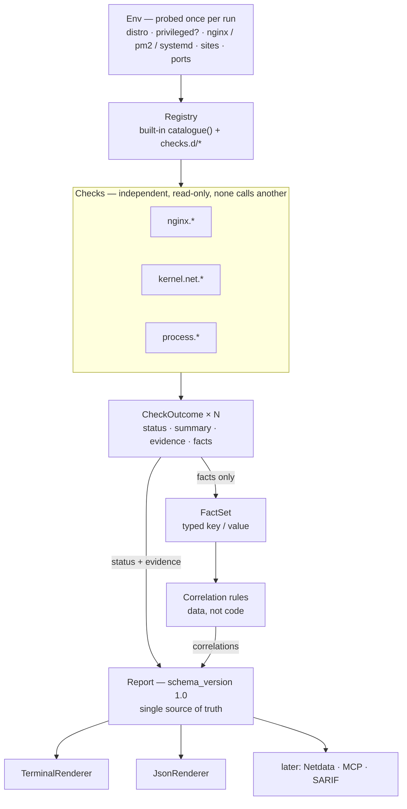
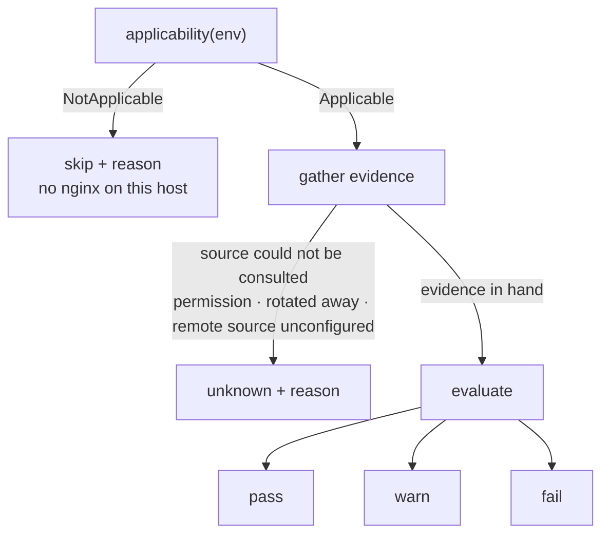

# whatbroke — architecture (v1)

A single-binary diagnostic CLI for servers. It inspects resources, kernel and
network limits, reverse-proxy configuration, process supervision, TLS, and
CDN-origin behaviour, then **reaches a conclusion** rather than printing
numbers.

v1 ships one thing: the CLI. The architecture below exists so that the surfaces
that come later — a Netdata plugin, an MCP tool, third-party checks — attach
without reopening the core.

---

## 1. Scope

### 1.1 In scope for v1

- A `whatbroke` binary that runs a catalogue of read-only checks and prints a verdict.
- A stable, versioned JSON report (`--json`).
- Extension seams for checks, correlation rules, evidence sources, and output
  surfaces (§3).

### 1.2 Explicitly out of scope for v1

| Not building | Why |
|---|---|
| Client/server, push protocol, central aggregator | Where fleet reach is needed, a Netdata Parent already provides it. Building a second one is duplicated transport with none of the maturity. |
| A metrics agent | Netdata, CloudWatch, and `sar` already record. This reads what they recorded. |
| A dashboard or web UI | A general observability tool must show everything because it cannot know what you are looking for. A diagnostic tool knows the question, so its output is a verdict. |
| Remediation | Every check is read-only. Findings carry remediation *text*, never actions. |

These are scope decisions, not permanent bans — but each one currently exists in
a better form elsewhere, and taking them on is how this turns into a worse
Netdata.

### 1.3 Why a CLI first

The unique value is diagnosis, and diagnosis is inherently on-demand: you run it
during or after an incident, once, and you want an answer. That shape is a CLI.

The distribution consequence matters as much as the technical one. `curl | sh`
and run has no standing cost — no install to maintain, no agent to supervise, no
resource footprint on a host whose resource exhaustion may be the thing under
investigation.

---

## 2. Concepts

Before the individual pieces, the shape of one run:



Three properties of that diagram are the architecture, and the rest of this
document is mostly their consequences:

- **`Env` sits upstream of everything** and is built exactly once (§3.2).
- **Evidence never reaches the rules.** Correlations consume the typed fact set;
  raw excerpts flow only into the report (§2.4). A check can rephrase its output
  without breaking a rule that depends on it.
- **Every renderer is downstream of the report** (§3.5). Nothing past the report
  computes a verdict, so two surfaces cannot disagree.

### 2.1 Check

The unit of diagnosis: self-contained, read-only, independently runnable.

Checks never call each other. Cross-check reasoning lives in §2.4, so that a
check stays a pure function from *evidence* to *verdict* and can be tested in
isolation.

### 2.2 Verdict: five states, not three

This is the decision that separates a diagnostic tool from a monitoring
threshold. Monitoring has `ok / warn / critical`. Diagnosis needs two more:

| Status | Meaning | Why it must exist |
|---|---|---|
| `pass` | Checked, healthy | |
| `warn` | Checked, risky | |
| `fail` | Checked, broken | |
| `skip` | Not applicable — no nginx on this host | Without it, "no findings" silently masquerades as "healthy" |
| `unknown` | Applicable, but undeterminable — needs root, log already rotated | The honesty state. A tool that cannot say "I could not tell" will eventually say something false |

`unknown` is load-bearing, not a fallback. Absence-of-evidence and
evidence-of-absence are different results, and a diagnostic tool that cannot
distinguish them will confidently mislead. Concretely: an empty nginx error log
during a 522 is *positive evidence* — it proves the requests never reached
nginx, which is what 522 means. The same empty log during a 520 is a *gap*,
because 520 evidence is supposed to be in that file. Same observation, opposite
meaning; the schema must be able to carry both.

Every `skip` and `unknown` carries a machine-readable reason, so a caller can
tell "this host has no nginx" from "I could not read the config".

The path to each state is mechanical:



The edge into `unknown` is about the *source*, not the *content*. A log that is
readable but empty is evidence: it goes right, into `evaluate`, where the check
decides what emptiness means — positive proof for a 522 check, a gap for a 520
one. Only a source that could not be consulted at all yields `unknown`.

### 2.3 Evidence

Every verdict carries what produced it: the command executed, the file and line
read, the raw excerpt, the parsed value.

Mandatory, not decorative, for two reasons:

1. A verdict without evidence is unactionable — the operator cannot confirm it.
2. When the consumer is an AI agent, evidence lets it reason past a wrong
   verdict instead of inheriting the mistake.

**Operator input is evidence too.** Some conclusions rest on knowledge only a
person has — which endpoints are legitimately slow, whether the application
tolerates multiple processes (§3.11). Where a verdict rests on a declaration
rather than a measurement, that declaration appears in `evidence` with kind
`operator_input`, recording what was declared and where it came from. Otherwise
the report carries conclusions with no traceable origin, and a year later nobody
can tell whether "this endpoint is supposed to take 90s" was measured, inferred,
or typed once by someone who has since left.

### 2.4 Facts and correlations

Checks are independent; failures are not.

A check may publish **facts** — small typed key/values — into a shared fact set:
`process.pm2.mode = fork`, `edge.codes_seen = [520, 522]`,
`system.memory.under_pressure = true`.

**Correlation rules** then match over facts and check statuses to emit
higher-order findings:

```
edge.codes_seen ⊇ {520, 522}
  AND process.pm2.mode = fork
  AND system.memory.under_pressure
  → "upstream is restarting under memory pressure"

edge.codes_seen ∋ 522  AND  kernel.net.listen_overflow > 0
  → "listen queue overflow, not a network fault"

edge.codes_seen ∋ 520  AND  nginx.error_log.clean
  → 520-at-nginx ruled out; evidence points upstream

edge.codes_seen ∋ 520  AND  nginx.keepalive.seconds < 900
  → "origin closes idle connections before the edge stops reusing them"
```

That last rule is why a fact carries the code that was *observed* rather than
the code a cause is supposed to produce. Cloudflare's 900s Proxy Idle Timeout
returns **520**; **522** is what the edge reports when the origin refuses
keepalive outright. Both conditions point at `keepalive_timeout`, so a rule
firing on either code would prescribe the same change for two different
failures and be wrong about one of them. Predicating on the observed code keeps
the two apart — and is the difference between a diagnosis and a guess dressed
as one.

This is the layer no monitoring product has, and where the accumulated knowledge
in the current shell scripts actually lives. Correlations read *facts*, never
raw evidence strings, so a rule cannot break when a check changes how it phrases
its output.

### 2.5 Profiles

A check reports what is broken now. A correlation explains what several
observations mean together. Neither answers the question worth asking *before*
an incident: **given this stack, is the configuration known to be resilient?**

That is a profile — a set of assertions that apply when a particular combination
of software is present.

| Layer | Question | Highest verdict it may reach |
|---|---|---|
| Check | Is this thing broken right now? | `fail` |
| Correlation | What do these observations mean together? | `fail` (§3.4) |
| **Profile** | Does this stack have the configuration that prevents a known failure? | **`warn`** |

That ceiling is the whole point. A `keepalive_timeout` of 65s is not a failure —
the site may have served every request today without incident — it is a
configuration that will eventually produce 520s once a connection sits idle.
Reporting it as `fail` would redefine the exit code from "something is broken"
to "something is imperfect somewhere", and an exit code that cannot tell those
apart is one nobody wires into automation.

Two constraints follow from a profile being predictive rather than
observational.

**Activation must be proven, not assumed.** A profile firing on the wrong stack
gives confident advice about software the host is not running, and the operator
has no way to tell that this is what happened. Prevalence is not evidence:
"most sites are behind Cloudflare" is a fact about the population, not an
observation about this host.

Reading it from a local request's response headers is the specific trap — a
request to `127.0.0.1` never traverses the edge, so its headers prove nothing in
either direction. Evidence that does carry weight, by strength:

| Strength | Evidence | Why it is worth that much |
|---|---|---|
| Strong | Client IPs in the access log fall inside Cloudflare's current ranges | Traffic evidence: this host *is being* proxied, not merely configured for it once |
| Strong | `CF-Ray` observed by an external probe (§3.6 `Source`) | Unambiguous, but requires a probe |
| Strong | Operator declaration (§3.11) | |
| Moderate | `set_real_ip_from` lists Cloudflare ranges | Intent — possibly left from a migration years ago |
| Moderate | Firewall admits only Cloudflare ranges | Same |
| Weak | Authoritative DNS delegates to Cloudflare | May cover only some subdomains; `/etc/hosts` can mask it |
| None | Response headers of a local request | Proves nothing either way |

One strong signal activates the profile; two moderate ones activate it; less
than that is `skip { NotApplicable }`.

**The log-based signal inverts, and an implementation that misses this will be
wrong on the best-configured hosts.** Where `set_real_ip_from` is correctly
set, nginx has already rewritten `$remote_addr` to the *visitor's* address, so
the log contains almost no Cloudflare IPs at all — the better the configuration,
the weaker this signal appears. A check reading it must use
`$realip_remote_addr`, which nginx keeps for the pre-rewrite address, or the
`CF-Connecting-IP` header where the log format records it, and otherwise fall
back to the moderate `set_real_ip_from` signal. Reading `$remote_addr` alone
concludes "not behind Cloudflare" precisely on the hosts that are set up
properly.

Three further constraints on that signal:

- **Count unique client IPs, not requests.** A single monitoring probe can
  contribute tens of thousands of requests from one address and dominate a ratio
  meant to describe the visitor population.
- **Only the extremes decide.** ≥95% inside Cloudflare's ranges activates; ≤5%
  rules it out; in between is `unknown` — and is itself a finding, since a site
  that is proxied *and* taking substantial direct traffic has most likely leaked
  its origin IP, which §7's `edge.cloudflare` domain already looks for.
- **Below a sample floor there is no ratio.** Under roughly 100 unique client
  IPs in the window the percentage is noise, and the signal degrades to
  `unknown` rather than answering confidently from a dozen addresses.

The range list is versioned data like any profile threshold (§3.10): a snapshot
ships with the binary carrying its `verified_on`, refreshes from
`cloudflare.com/ips-v4` when the network allows, and when it cannot be refreshed
the report states which snapshot was used. A diagnostic running during an outage
may well have no egress — here that is the normal case, not the edge case.

**Every threshold carries its provenance.** A profile is mostly third-party
constants, and third parties change them. Cloudflare's Proxy Read Timeout was
100s for years and is 125s today; the response-header cap was widely documented
as 32 KB and is now 128 KB in total. Both numbers were wrong in this project's
own scripts until they were checked against the vendor's current documentation.
An assertion therefore stores the URL it came from, the value as documented, and
the date that was last verified — and a verification date going stale is itself
something the tool can report, rather than a silent slide into giving advice
from a number nobody has looked at in two years.

### 2.6 Report

One versioned document is the single source of truth. Every output format is a
projection of it (§3.5). Nothing downstream may compute a verdict that is not
already in the report.

---

## 3. Extension model

Five axes, each designed so that extending along it requires no change to the
core.

| Axis | Extend by | Requires recompiling? |
|---|---|---|
| A. New check | Implement `Check`, register it | Yes (built-in) / No (external, §3.3) |
| B. New correlation | Add a rule | No — rules are data |
| C. New output surface | Implement `Renderer` | Yes, in the surface crate only |
| D. New evidence source | Implement `Source` | Yes, in `whatbroke-core` |
| E. New execution context | Supply a different `RunContext` | No |
| F. New incident playbook | Tag existing checks and rules, add a grouping renderer (§3.12) | Yes, for the tag |

### 3.1 The `Check` trait

```rust
pub trait Check: Send + Sync {
    fn meta(&self) -> &CheckMeta;

    /// Decide whether this host is even a candidate. Returning
    /// `NotApplicable` yields a `skip` carrying the reason.
    fn applicability(&self, env: &Env) -> Applicability;

    /// Gather evidence and evaluate. Must be read-only and must poll
    /// `ctx.cancelled()` around anything slow.
    fn run(&self, ctx: &RunContext) -> CheckOutcome;
}

pub struct CheckMeta {
    pub id: CheckId,          // "nginx.keepalive_below_cf_window"
    pub title: &'static str,
    pub domain: Domain,       // system | kernel.net | nginx | process | tls | edge.cloudflare
    pub severity: Severity,   // severity IF it fires
    pub refs: &'static [&'static str],
    pub explain: &'static str, // what it inspects, why it matters, how to fix
}

pub enum Applicability {
    Applicable,
    NotApplicable { reason: SkipReason },
}

pub enum Status {
    Pass,
    Warn,
    Fail,
    Skip    { reason: SkipReason },
    Unknown { reason: UnknownReason },
}

/// Closed sets, not free text. §2.2 requires that a caller can tell "no nginx
/// here" from "I could not read the config" without parsing English, and §3.9
/// adds four more reasons the runtime itself produces.
pub enum SkipReason {
    NotApplicable,      // no nginx on this host
    SourceUnconfigured, // remote Source has no credentials (§3.6)
    Retired,            // withdrawn check, kept one release (§3.8)
}

/// `NeedsInput` is `unknown` and not one of the alternatives, each of which
/// fails differently: `skip` would claim the check does not apply when it does;
/// `pass` would record "I do not know" as "this is fine", the exact failure
/// §2.2 exists to prevent; `warn` would push an unproven concern into the exit
/// code. A sixth status would break §8.1's mapping for no gain. It carries an
/// `InputKey` rather than a bare marker so the report can say *what* to supply
/// — "I could not judge this" is not actionable, "declare which endpoints are
/// meant to run long" is.
pub enum UnknownReason {
    PermissionDenied,
    EvidenceGone,       // log rotated away entirely
    WindowTruncated,    // retained logs cover only part of --window (§3.9)
    Timeout,
    Cancelled,
    InternalError,      // the check panicked (§3.9)
    NeedsInput { key: InputKey },  // only a person can answer this (§3.11)
}

pub struct CheckOutcome {
    pub status: Status,
    pub summary: String,
    pub evidence: Vec<Evidence>,
    pub facts: Vec<Fact>,          // published for correlations (§2.4)
    pub remediation: Option<String>,
}
```

`explain` lives on the check, not in prose, because the reference tables in the
current README are the most reused part of this project and prose drifts away
from the code it describes. `whatbroke explain <id>` reads this field.

### 3.2 The environment probe

`Env` is built once per run, before any check executes: OS and distro, whether
running as root, which of nginx / pm2 / systemd / sysstat are present, nginx
prefix and config paths, discovered sites and upstream ports.

It is a **capability snapshot, not an inventory**. The temptation in a
"what is on this machine" layer is to enumerate every installed package, which
turns a diagnosis into an asset audit: slow, permission-hungry, and mostly
irrelevant to why the edge returned 520. `Env` probes only what some check's
`applicability` or some profile's `applies_when` actually predicates on:

- OS, distro, architecture, and any container / cgroup limits
- privilege level, and whether systemd / nginx / pm2 / Node / docker / Netdata
  are present, with versions
- key config and log paths, listening ports, and one shared `nginx -T` snapshot

Every entry records where it came from and, when a probe failed, why. "pm2 is
not installed" and "pm2 is installed but could not be run" send a check to
`skip` and `unknown` respectively (§2.2); collapsing them here makes that
distinction unrecoverable downstream.

Where `Env` stops and §3.11 begins is not an arbitrary line: **`Env` measures
technical fact; the operator supplies business intent.** Whether Node is running
is measurable. Whether a 90-second endpoint is working as designed is not, and
no amount of probing will make it so. A check that finds itself inferring intent
from measurement — "this path is usually slow, so it is probably meant to be" —
has found the boundary and should be asking instead.

Building it once matters for correctness, not just speed: forty checks each
independently shelling out to `nginx -T` would produce forty possibly-different
views of the config within one run.

### 3.3 Registry and external checks

Built-in checks are registered explicitly in one `catalogue()` function —
deterministic order, no macro magic, greppable.

For extension **without recompiling**, the registry also accepts **external
checks**: an executable in a drop-in directory that prints a `CheckOutcome` as
JSON on stdout.

```
$XDG_CONFIG_HOME/whatbroke/checks.d/*      →  executed, stdout parsed as CheckOutcome
```

The contract is deliberately the same shape as the internal trait, so an
external check is a first-class citizen: it appears in `whatbroke list`, it can
publish facts (registered keys match built-in correlation rules; `x.`-prefixed
keys are for user-supplied rules — §3.8), and it is subject to the same timeout
and cancellation. This is the extension path for site-specific
knowledge that will never belong upstream.

### 3.4 Correlation rules as data

```rust
pub struct CorrelationRule {
    pub id: RuleId,
    pub title: String,
    pub severity: Severity,
    pub when: Vec<Predicate>,      // all must hold
    pub explanation: String,       // may interpolate matched facts
}

pub enum Predicate {
    Status  { check: CheckIdPattern, is: Vec<Status> },
    FactSet { key: FactKey, contains: FactValue },
    FactCmp { key: FactKey, op: CmpOp, value: FactValue },
    Not(Box<Predicate>),
}
```

Because rules are data rather than conditionals, they can be loaded from file,
listed, unit-tested against synthetic fact sets, and reviewed by someone who is
not a Rust programmer. Adding institutional knowledge should not require a
compiler.

Being data, their evaluation has to be specified rather than left to emerge from
the order someone happened to write them in:

| Question | Decision | Why |
|---|---|---|
| Several rules match | **All fire** — not first-match-wins | One incident can have two true causes. Suppressing the second is how a diagnosis degrades into a guess |
| Output order | `severity` descending, then `id` lexicographically | Deterministic output is diffable between runs and testable against a golden file |
| May a rule read another rule's output? | **No.** One pass over the fact set | Chaining reintroduces ordering and cycles into what is meant to be declarative. A higher-order conclusion is a new rule over the same facts |
| May a rule change a check's status? | No | The check owns its verdict; a rule adds a finding beside it |

A correlation **may raise `summary.verdict`, never lower it**. Three independent
`warn`s that together mean the upstream is dying is precisely what this layer
exists to catch, and a conclusion that cannot move the exit code is one nobody's
automation will ever act on. The converse is forbidden: no rule may explain away
a `fail`.

### 3.5 Renderers

```rust
pub trait Renderer {
    fn render(&self, report: &Report, out: &mut dyn Write) -> io::Result<()>;
}
```

v1 ships `TerminalRenderer` and `JsonRenderer`. Later surfaces — a Netdata
function table, an MCP tool result, SARIF — are additional implementations in
their own crates. **No check logic may live in a renderer**; a renderer that
computes a verdict is a bug, because it means two surfaces can disagree.

### 3.6 Evidence sources and the `HostAccess` seam

All filesystem and process access goes through one trait:

```rust
pub trait HostAccess: Send + Sync {
    fn read_file(&self, path: &Path) -> io::Result<String>;
    fn glob(&self, pattern: &str) -> io::Result<Vec<PathBuf>>;
    fn now(&self) -> DateTime<Utc>;

    /// Every execution carries its own deadline and cancellation. §3.9 requires
    /// a hung `nginx -T` to be killed at the 5s mark; a signature without them
    /// cannot express that, and adding them later means touching every call
    /// site in the catalogue.
    fn exec(&self, cmd: &Cmd, opts: ExecOptions<'_>) -> io::Result<Output>;

    /// A log plus its rotations, decompressed, narrowed to `window` and
    /// ordered by event time. Rotation and compression are environment
    /// concerns, never check concerns (§3.9).
    fn read_rotated(&self, path: &Path, window: TimeWindow) -> io::Result<LogSlice>;
}

pub struct LogSlice {
    pub lines: Vec<LogLine>,
    pub covered: TimeWindow,    // what was actually available; may be narrower
    pub sources: Vec<PathBuf>,  // which files were read, recorded as evidence
}

pub struct ExecOptions<'a> {
    pub deadline: Instant,
    pub cancel:   &'a CancelToken,
}
```

Two obligations come with `ExecOptions`, and neither is optional for
`LiveHost`:

- **The child starts in its own process group, and the deadline signals the
  group** — `SIGTERM`, then `SIGKILL` after a grace period. Signalling only the
  direct child leaves whatever it spawned still running and still holding the
  pipe, which is how a "timeout" turns into a hang anyway.
- **Timing out is not an error the check invents a verdict for.** It surfaces as
  `UnknownReason::Timeout` (§3.1), so a slow host cannot read as a broken one.

`FixtureHost` ignores `deadline` — replaying a recording takes no time — but
must still honour `cancel`, or the cancellation path in §3.9 has no test.

`read_file` and `glob` deliberately take no deadline. `exec` is the only call
that spawns something capable of hanging indefinitely; a pathological read is
covered by the whole-run budget instead. That is a deliberate asymmetry, not an
oversight — if a `/proc` read is ever observed to block in practice, it gets the
same treatment rather than a second mechanism.

`LogSlice::covered` is the reason rotation lives behind the trait rather than in
a helper: a check cannot report honestly about a window it did not fully see
unless the layer that read the files tells it what it got.

`LiveHost` in production; `FixtureHost` in tests, backed by recorded
`/proc` contents, `nginx -T` dumps, and log excerpts.

This seam is not academic. The predecessor shell scripts carry an explicit
caveat that they were never run end-to-end on a real Linux server, because the
development machine is macOS with no nginx, pm2, or `/proc`. A fixture-backed
`HostAccess` is what turns that permanent caveat into a test suite that runs
anywhere.

Remote evidence sources (the Cloudflare GraphQL Analytics API, a Netdata query
endpoint) implement a parallel `Source` abstraction with the same testability
property, and are always optional: a check whose remote source is unconfigured
returns `skip`, never `fail`.

#### Fixtures

A seam is worth exactly what its fixtures cover, so recording them is a shipped
capability rather than a test-time afterthought:

```bash
whatbroke capture --out fixtures/nginx-keepalive-65
```

`capture` runs the normal catalogue against `LiveHost` and records every read,
glob and exec into a bundle:

```
fixtures/nginx-keepalive-65/
  manifest.toml           distro, kernel, privileged?, capture time, tool version
  fs/etc/nginx/nginx.conf
  fs/proc/net/netstat
  exec/nginx_-T.stdout    exit status and stderr recorded alongside
  exec/ss_-lnt.stdout
```

Three rules keep the fixtures honest:

- **A `FixtureHost` miss fails the test; it never returns an empty result.**
  Reading a path the bundle does not contain panics with that path. Silently
  answering "not found" would let a check pass its tests by reading nothing at
  all — §2.2's false-healthy failure, reproduced inside the test suite.
- **Every check ships at least three fixtures**: one where it fires, one where it
  does not, and one where its evidence is unreadable — so the `unknown` path is
  exercised as deliberately as the other two.
- **Capture redacts on write.** Access logs carry client IPs and hostnames.
  `capture` maps them through a stable pseudonymiser — identical input to
  identical output *within* a bundle, so log-correlation checks still work — and
  records in the manifest that it ran. A bundle that cannot be shared is a
  bundle that will not be committed, and an uncommitted fixture protects nothing.

### 3.7 `RunContext` — designing for execution models v1 does not have

```rust
pub struct RunContext<'a> {
    pub env: &'a Env,
    pub host: &'a dyn HostAccess,
    pub window: TimeWindow,        // for log/history analysis
    pub cancel: &'a CancelToken,
    pub progress: &'a dyn ProgressSink,
}
```

The CLI never cancels anything and reports progress to `/dev/null`. Both are in
the signature from day one anyway, because the surfaces on the roadmap need
them: a Netdata function can be cancelled mid-run when the user navigates away,
and must report progress to keep its timeout alive.

Retrofitting cooperative cancellation into a catalogue of forty checks later is
not an extension, it is a rewrite of all forty. The seam costs almost nothing
now and cannot be added cheaply later.

### 3.8 Stability contracts

Three names in this design are read by things the compiler cannot reach: JSON
consumers, external checks, rule files, operators' one-liners. They are public
contracts from the first release, and treating them as internal details is a
cost paid entirely by other people.

#### Check IDs

Format `<domain>.<subject>_<predicate>`, lowercase, dot-separated —
`nginx.keepalive_below_cf_window`.

An ID appears in the report, in `explain <id>`, in `--check` globs, in
correlation predicates, and in external check output. So:

- **Renaming is additive.** The new ID ships while the old one stays in
  `CheckMeta.aliases`. The report always emits the canonical ID; `--check` and
  rules accept either; the alias survives at least one minor release.
- **Retiring is staged.** A withdrawn check first becomes
  `skip { reason: "retired" }` for one release, then disappears. A check that
  simply vanishes makes every rule and script naming it quietly stop applying,
  which on a terminal reads exactly like "nothing is wrong".

#### Fact keys

Format `<domain>.<subsystem>.<name>` — `process.pm2.mode`.

- **Keys are declared, not spelled.** `FactKey` is a registry of constants, not a
  string literal at the call site. A typo becomes a compile error instead of a
  rule that never matches, and "which rules consume this fact" stays greppable —
  the property that makes the rule layer reviewable at all.
- **A key's type is frozen once published.** Widening `edge.codes_seen` from a
  scalar to a list is a breaking change that no compiler will report: the
  `FactCmp` predicate against it simply stops matching, and a rule that silently
  stops firing is worse than one that fails to load. Type changes need a new key.
- **Facts carry parsed values, never prose.** `nginx.keepalive.seconds = 65`, not
  `"keepalive_timeout is 65s"`. The sentence belongs in `summary`, which no rule
  is permitted to read (§2.4).
- **External checks publish into a reserved namespace.** A closed registry and
  an external check (§3.3) that has no compiler cannot both be satisfied by one
  rule, so they get two. An external check may publish a **registered** key —
  validated against its declared type, usable by built-in correlations — or any
  key under the reserved `x.` prefix (`x.<vendor>.<name>`), which is stored,
  rendered and available to *user-supplied* rule files, but never matched by a
  built-in rule. A key that is neither registered nor `x.`-prefixed is dropped
  with a warning rather than failing the check. Built-in checks may not use the
  `x.` prefix.

  This keeps the type safety where it matters — no external input can silently
  change what a shipped rule means — without demoting site-specific knowledge to
  free text, which is what forbidding external facts outright would do.

#### Reason codes

`SkipReason` and `UnknownReason` (§3.1) are closed sets inside one binary but
growing sets across releases — `NeedsInput` did not exist in the first draft of
this document. A consumer must therefore treat an unrecognised reason as the
generic status it qualifies (`skip` / `unknown`) rather than failing to parse,
and adding a reason is an additive change that does not bump `schema_version`.
Removing or repurposing one is breaking, and follows the same staged path as
retiring a check.

#### Admitting a new check

Six conditions, enforced in review and, where the tooling allows, in CI:

1. `applicability` is implemented, and every `NotApplicable` carries a reason.
2. Three fixtures: fires, does not fire, evidence unreadable (§3.6).
3. `explain` says what it inspects, why it matters, and how to fix it.
4. Every fact it publishes is registered in `FactKey` with a documented type.
5. All outside access goes through `HostAccess` — no direct `std::fs` or
   `std::process` inside a check module. This one is a lint, not an etiquette.
6. Read-only: no writes, no service control, no mutating network calls.

---

### 3.9 Execution model

The host being diagnosed may be the host that is failing. Every decision below
follows from that one sentence.

| Concern | Decision | Why |
|---|---|---|
| Concurrency | Fixed pool, `min(available_parallelism, 4)` | Checks are IO-bound, so a wide pool buys little. On a box already in memory or IO collapse — §1.3's entire premise — forty concurrent subprocesses are a second incident |
| Result order | Catalogue order, never completion order | Two runs against the same host produce diffable reports |
| Per-check deadline | 5s, `--timeout` to change | Long enough for `nginx -T` against a large config, short enough that one stuck check cannot eat the run budget on its own |
| Whole-run budget | 60s | A diagnosis that has not answered within a minute has stopped being useful during an incident |
| Timeout outcome | `unknown { reason: "timeout" }` | A timeout means "I could not tell", not "the server is broken". Mapping it to `fail` makes a slow host indistinguishable from a broken one, and fails the run through the exit code |
| Subprocess overrun | The process **group** is signalled at the deadline (`SIGTERM`, then `SIGKILL`); exit status kept as evidence | A hung `nginx -T` must not outlive its check, or it consumes the global budget on behalf of everything else. Signalling only the direct child leaves its own children holding the pipe |
| Check panics | Caught per check → `unknown { reason: "internal_error" }`, panic message as evidence | Mid-incident, "the tool crashed" is the worst output available. One bad check — most likely an external one (§3.3) — costs one row, not the report |
| Cancellation | Finished checks are reported, the rest become `unknown { reason: "cancelled" }`, and the report is still written | A partial report beats no report. This is what `cancel` in `RunContext` is for (§3.7) |

#### Time window and log rotation

`--window` is defined over **event time** — the timestamps inside the log lines —
not file mtime, so a window does not shift because a file was touched.

Reading a window that predates the current log file is therefore routine, and
rotation handling belongs to `HostAccess` (`read_rotated`), not to each check:
finding `access.log.1`, decompressing `access.log.2.gz`, and presenting the lines
in order is environment interaction, and anything a check does directly is
something a fixture cannot stand in for.

When the retained logs do not cover the requested window, the run reports what it
actually read:

```json
"window": {
  "from":         "2026-08-21T03:00:00Z",
  "to":           "2026-08-21T09:00:00Z",
  "covered_from": "2026-08-21T06:12:44Z"
}
```

and the affected check returns `unknown { reason: "window_truncated" }` when the
missing span could plausibly hold what it was looking for. Quietly analysing four
hours when six were asked for produces the most dangerous output this tool is
capable of: a clean verdict that only means the evidence had already been
deleted.

---

### 3.10 Profiles as data

Like correlation rules (§3.4), a profile is data rather than a Rust type per
stack, for the same reason: this knowledge changes far more often than the
engine evaluating it, and the people who hold it are not necessarily Rust
programmers.

```rust
pub struct Profile {
    pub id: ProfileId,                 // "cloudflare-nginx-node"
    pub title: String,
    pub applies_when: Vec<Predicate>,  // §3.4's predicate language, over Env
    pub assertions: Vec<Assertion>,
}

pub struct Assertion {
    pub id: AssertionId,               // "nginx.keepalive_above_idle_timeout"
    pub requires: Vec<Predicate>,      // over facts published by checks
    pub remediation: String,
    pub source: Provenance,            // §2.5
}

pub struct Provenance {
    pub url: String,
    pub documented_value: String,      // "900"
    pub verified_on: NaiveDate,        // 2026-08-21
}
```

`Assertion` deliberately has no `severity`. Profiles cap at `warn` (§2.5), so a
per-assertion severity could only encode a distinction the report is forbidden
to make. An assertion whose required facts are absent is `unknown`, never a
pass — the same rule that governs checks, for the same reason.

#### The first profile: `cloudflare-nginx-node`

`applies_when`: nginx present **and** a Node upstream behind `proxy_pass`
**and** Cloudflare confirmed by one of the sources in §2.5. Anything less is
`skip { NotApplicable }`.

**`keepalive_above_idle_timeout`** — requires `nginx.keepalive.seconds >= 905`
Cloudflare holds an idle origin connection for up to its 900s Proxy Idle
Timeout and returns **520** when that fires. Raising the origin above it removes
one cause of 520. It does not claim every 520 originates here, and it claims
nothing at all about 522.

**`read_timeout_layering`** — requires `nginx.proxy_read_timeout.seconds` set
explicitly per vhost, and consistent with the slowest legitimate endpoint
Below 125s, nginx times out first and the client sees a 502/504 — the evidence
lands in the nginx log. Above 125s, Cloudflare's Proxy Read Timeout fires first
and the client sees **524** — the evidence lands at the edge. Neither is wrong;
what is wrong is not having decided, and inheriting nginx's 60s default on a
streaming endpoint. This assertion is about the choice being deliberate, not
about a particular number.

**`header_budget`** — requires no `upstream sent too big header` in the window,
and `proxy_buffer_size` above the largest header actually observed
The 128 KB total is Cloudflare's ceiling, but `proxy_buffer_size` is the limit a
response hits first, and only that setting governs headers — `proxy_buffers`
sizes the body and is not involved. The log line is the primary evidence; the
configured value is a secondary signal used when no such line exists.

**`supervisor_restart_window`** — requires `process.pm2.mode = cluster` and
`process.pm2.instances > 1`
A single fork-mode instance leaves a window during `restart` with no upstream at
all, which normally surfaces as **502** — nginx is up, the backend is not —
rather than 520 or 522. Cluster mode has its own precondition: the application
must tolerate multiple processes, meaning stateless or externalised sessions,
and a sticky strategy if it serves WebSockets. This reports a deployment risk;
it is not an unconditional instruction to switch.

**`node_heap_budget`** — requires `--max-old-space-size` set explicitly, and
`instances × heap_mb` plus headroom below `min(system memory, cgroup limit)`
V8 enforces its own heap ceiling, so a heap OOM never reaches the kernel OOM
killer and `dmesg` stays perfectly clean — the textbook "random 520 that leaves
no trace and fixes itself". The budget has to subtract nginx, the OS and every
concurrent instance; "smaller than the container" is not the test.

**`real_ip_configured`** — requires `real_ip_header = CF-Connecting-IP` and
`set_real_ip_from` covering Cloudflare's current ranges
Conditional: it applies only where real visitor IPs are actually needed — rate
limiting, geo rules, audit, abuse triage. Cloudflare's ranges change, so the
assertion is that a refresh mechanism exists, not that a static list matches
today's snapshot. A stale `set_real_ip_from` is worse than none: it silently
records some requests with the edge's address instead of the visitor's.

---

### 3.11 Operator input

A small closed set of questions cannot be answered by probing, because their
answers are business intent rather than machine state (§3.2):

| `InputKey` | Question | Consumed by |
|---|---|---|
| `slow_endpoints` | Which paths are legitimately long-running? | `read_timeout_layering` |
| `needs_real_visitor_ip` | Does anything depend on the visitor's address — rate limits, geo rules, audit? | `real_ip_configured` |
| `cloudflare.proxy_read_timeout_seconds` | Enterprise zones may raise the 125s budget as far as 6000s | `read_timeout_layering` |
| `app_multi_process_safe` | Can the application run as more than one process — stateless or externalised sessions, sticky WebSockets? | `supervisor_restart_window` |
| `production_hostnames` | Which of the configured `server_name`s carry real traffic? | external probes, edge checks |

```toml
# ./whatbroke.toml
[app]
multi_process_safe = true
slow_endpoints = ["/api/export", "/api/stream"]

[cloudflare]
proxy_read_timeout_seconds = 600   # Enterprise zone

[nginx]
needs_real_visitor_ip = true
```

**Optional, never required.** A run with no input at all still produces every
technical fact and most assertions; the ones that depend on intent report
`unknown { NeedsInput }` and name what they need. This is not politeness —
§1.3's `curl | sh` distribution has no room for "first write a config file", and
a diagnostic that cannot be run cold in the middle of an incident is a
diagnostic nobody runs.

Discovery order, first match wins per key, flags overriding files:

1. `--config <path>`
2. `./whatbroke.toml`
3. `$XDG_CONFIG_HOME/whatbroke/config.toml` (the same tree as `checks.d/`, §3.3)

`./whatbroke.toml` sits above the user-level file deliberately: business intent
belongs to the application, not to the machine it happens to run on. Committed
beside the code it is reviewed when the code changes, it travels to the next
host, and "which endpoints are supposed to be slow" acquires a history instead
of living in one server's `/etc` until that server is replaced.

**Input declares facts; it never edits thresholds.** `proxy_read_timeout_seconds
= 600` states something true about this Cloudflare zone, and the assertion
reasons from it. There is deliberately no way to say "require keepalive above
60s instead of 905s": a profile whose thresholds the site can overwrite has
stopped carrying outside knowledge and merely repeats the operator's own opinion
back to them with added authority.

Every declared value that reaches a verdict appears in that verdict's evidence
as `operator_input` (§2.3).

---

### 3.12 Incident playbooks

An operator does not arrive thinking "run the nginx domain". They arrive
thinking **"I am looking at 520s"**. A 52x investigation spans checks in
`nginx`, `process`, `kernel.net` and `tls`, the `cloudflare-nginx-node` profile,
several correlation rules, and an edge `Source` — it is a view across every
layer, not a member of any one of them.

The tempting move is to make it a vertical module owning its own checks. That
is the wrong cut: nginx configuration analysis belongs to 520, to 524 and to
"the site got slow", so a vertical module means three copies of one check, which
then drift — the same failure §3.2 avoids by building `Env` once.

A playbook therefore **selects and presents; it never concludes**:

```rust
pub struct CheckMeta {
    // ...
    pub incidents: &'static [IncidentClass],   // "52x", "slow-origin", ...
}
```

- **Selection** — `--incident 52x` filters the catalogue and the rule set by
  that tag. It is a filter, nothing more.
- **Presentation** — a `Renderer` variant groups the report by *error code*
  rather than by domain, which is how the question was asked in the first place.
- **The red line** — a playbook may not evaluate anything. The moment it decides
  something the checks did not, there are two layers reaching verdicts from one
  body of evidence and they will eventually disagree. §3.5 already forbids this
  for renderers; the same prohibition covers playbooks.

Because it is a tag rather than a container, one check belongs to as many
playbooks as apply and is still implemented once. Adding a playbook requires no
new check, no schema change, and no renderer beyond the grouping it wants —
which is why this is an extension axis (§3, axis F) rather than a new concept.

`diag-52x.sh` already contains this shape: its closing "reading guide organised
by error code" is exactly the 52x presentation, hand-written and welded to the
one incident class it knows.

---

## 4. Report schema (v1.0)

```json
{
  "schema_version": "1.0",
  "tool": { "name": "whatbroke", "version": "0.1.0" },
  "run": {
    "host": "web1",
    "started_at": "2026-08-21T09:14:03Z",
    "duration_ms": 2140,
    "window": { "from": "2026-08-21T03:00:00Z", "to": "2026-08-21T09:00:00Z" },
    "privileged": true
  },
  "summary": {
    "verdict": "fail",
    "counts": { "pass": 31, "warn": 4, "fail": 2, "skip": 9, "unknown": 3 }
  },
  "checks": [
    {
      "id": "nginx.keepalive_below_cf_window",
      "domain": "nginx",
      "title": "keepalive_timeout is shorter than Cloudflare's 900s Proxy Idle Timeout",
      "status": "fail",
      "severity": "high",
      "summary": "keepalive_timeout 65s < the 900s Proxy Idle Timeout; the edge reuses connections this origin already closed, which it reports as 520",
      "evidence": [
        {
          "kind": "config",
          "source": "/etc/nginx/nginx.conf:34",
          "excerpt": "keepalive_timeout 65;",
          "parsed": { "seconds": 65 }
        }
      ],
      "remediation": "Raise keepalive_timeout above 900s on server blocks behind Cloudflare.",
      "refs": ["https://developers.cloudflare.com/support/troubleshooting/http-status-codes/"]
    },
    {
      "id": "nginx.error_log_readable",
      "domain": "nginx",
      "status": "unknown",
      "reason": "permission_denied",
      "summary": "error log not readable; re-run as root",
      "evidence": [
        { "kind": "error", "source": "/var/log/nginx/error.log", "excerpt": "Permission denied" }
      ]
    },
    {
      "id": "process.pm2.fork_mode",
      "domain": "process",
      "status": "skip",
      "reason": "not_applicable",
      "summary": "pm2 is not installed on this host"
    }
  ],
  "facts": {
    "process.pm2.mode": "fork",
    "edge.codes_seen": [520, 522],
    "system.memory.under_pressure": true
  },
  "correlations": [
    {
      "id": "upstream.restarting_under_memory_pressure",
      "title": "Upstream is restarting under memory pressure",
      "severity": "critical",
      "derived_from": ["edge.codes_seen", "process.pm2.mode", "system.memory.under_pressure"],
      "explanation": "While the process is down the edge cannot connect (522); when it dies mid-request the edge receives a truncated response (520)."
    }
  ],
  "profiles": [
    {
      "id": "cloudflare-nginx-node",
      "applicable": true,
      "activated_by": {
        "signal": "access_log_client_ips_in_cf_ranges",
        "strength": "strong",
        "detail": "98.7% of 2431 unique client IPs, read from $realip_remote_addr",
        "ranges_snapshot": { "source": "cloudflare.com/ips-v4", "verified_on": "2026-08-14", "refreshed_this_run": false }
      },
      "status": "warn",
      "assertions": [
        {
          "id": "nginx.keepalive_above_idle_timeout",
          "status": "warn",
          "observed": { "nginx.keepalive.seconds": 65 },
          "required": ">= 905",
          "remediation": "Set 'keepalive_timeout 905s;' in the http block.",
          "source": {
            "url": "https://developers.cloudflare.com/fundamentals/reference/connection-limits/",
            "documented_value": "900",
            "verified_on": "2026-08-21"
          }
        },
        {
          "id": "process.node_heap_budget",
          "status": "unknown",
          "reason": "evidence_gone",
          "summary": "--max-old-space-size not visible; pm2 was not readable"
        },
        {
          "id": "nginx.read_timeout_layering",
          "status": "unknown",
          "reason": "needs_input",
          "needs": "slow_endpoints",
          "summary": "proxy_read_timeout is 60s; whether that is too short depends on which endpoints are meant to run long",
          "evidence": [
            { "kind": "config", "source": "/etc/nginx/sites-enabled/app:22", "excerpt": "proxy_read_timeout 60s;", "parsed": { "seconds": 60 } }
          ]
        },
        {
          "id": "process.supervisor_restart_window",
          "status": "pass",
          "evidence": [
            { "kind": "operator_input", "source": "./whatbroke.toml", "excerpt": "app.multi_process_safe = true" },
            { "kind": "command", "source": "pm2 jlist", "parsed": { "mode": "cluster", "instances": 4 } }
          ]
        }
      ]
    }
  ]
}
```

Schema rules:

- `schema_version` is mandatory and changes only on breaking edits.
- Consumers must ignore unknown fields, so additive changes stay compatible.
- `summary.verdict` is the rollup: worst of `fail > warn > pass`. **`unknown`
  never rolls up into `fail`**, but is always reported separately in `counts` so
  it cannot be mistaken for `pass`.
- A correlation may raise `summary.verdict`, never lower it (§3.4).
- `run.window.covered_from` / `covered_to` appear whenever the evidence actually
  read is narrower than the window requested (§3.9).
- Check IDs and fact keys follow §3.8. A renamed check emits its canonical ID
  while continuing to answer to its alias.
- **A profile may contribute at most `warn` to `summary.verdict`** (§2.5). A
  profile never produces `fail`, so a configuration that is merely unwise can
  never fail a run that is otherwise healthy.
- Every profile assertion carries `source.verified_on`. A consumer may treat a
  sufficiently old date as a reason to distrust the threshold.
- An unrecognised `reason` must be read as the generic status it qualifies, not
  as a parse failure (§3.8). New reasons are additive.
- Any verdict resting on a declaration rather than a measurement carries an
  `operator_input` evidence entry naming the file or flag it came from (§2.3).

---

## 5. Crate layout

```
whatbroke-core
  host/       HostAccess, LiveHost, FixtureHost — all IO, replaceable (§3.6)
  env/        capability snapshot, built once per run (§3.2)
  source/     remote evidence: Cloudflare API, Netdata queries — skip if unset
  check/      diagnostic units, one directory per domain (§7)
  facts/      the FactKey registry (§3.8)
  rules/      correlations, as data (§3.4)
  profiles/   stack profiles, as data (§3.10)
  input/      operator declarations: schema, discovery order (§3.11)
  playbooks/  incident tags and their grouping renderers (§3.12)
  report/     the §4 schema and its rollup
whatbroke-cli   the v1 binary: argument parsing, terminal + JSON renderers
```

The word **plugin** is reserved for the two genuine extension points — an
external check in `checks.d/*` (§3.3) and the Netdata `whatbroke.plugin` binary
(§8.1). Built-in functionality is a check inside a domain directory, never a
"plugin", because Netdata already uses that word for an external executable and
the two meanings would collide in exactly the place they meet.

Planned, not built in v1, and deliberately additive:

```
whatbroke-netdata  Netdata external plugin: protocol codec, evloop, stdout mutex
whatbroke-mcp      MCP tool surface
```

Future surfaces link `whatbroke-core` rather than shelling out to `whatbroke-cli`,
because cancellation, progress, and timeouts have to reach *inside* a run and a
subprocess boundary hides them.

### 5.1 Dependency posture

Deliberately thin. Every dependency is something that can fail to build on an
old box, which is exactly where this tool gets used.

| Need | Choice |
|---|---|
| Serialisation | `serde`, `serde_json` |
| CLI parsing | `clap` |
| System facts | `sysinfo`, plus direct `/proc` reads where being exact is cheaper |
| Process execution | `std::process` |

No async runtime in v1. If the Netdata surface later needs concurrency it is
three long-lived threads and a mutex, not a reactor.

### 5.2 Build target

Static linking against musl (`x86_64-unknown-linux-musl`,
`aarch64-unknown-linux-musl`) so one artifact runs across distros with no glibc
floor. macOS builds exist for development and for running the probe-style
checks from a laptop.

### 5.3 Toolchain conventions

Short, because the conventions that actually matter are in §3.8 and none of
these are questions of taste worth arguing about:

- `rustfmt` defaults; `clippy -D warnings` in CI.
- `#![forbid(unsafe_code)]` in both crates. A read-only diagnostic has no reason
  to reach for it, and it runs on hosts where a segfault would be blamed on the
  host.
- CI builds both musl targets and runs the fixture suite on every commit.
  Fixtures are the tier that decides whether a check works (§3.6).
- MSRV is whatever the oldest box we intend to build on ships, pinned and
  checked in CI rather than assumed — same reasoning as §5.1.

---

## 6. CLI surface

```bash
whatbroke run                       # all applicable checks, human output
whatbroke run --domain nginx,tls    # restrict by domain
whatbroke run --check 'nginx.*'     # restrict by id glob
whatbroke run --json                # the schema in §4
whatbroke run --window 6h           # log/history analysis window
whatbroke run --fail-on warn        # tighten the exit-code threshold
whatbroke run --no-profiles         # checks and correlations only (§2.5)
whatbroke run --incident 52x        # only what is tagged for this class (§3.12)
whatbroke run --config app.toml     # operator declarations (§3.11)

whatbroke list                      # every known check, with applicability on this host
whatbroke list --profiles           # profiles, with applicability and what activated them
whatbroke explain <id>              # a check or a profile assertion: what it
                                    # inspects, why it matters, how to fix, and
                                    # for an assertion, where its number came from
whatbroke capture --out DIR         # record this host's evidence as a fixture (§3.6)
```

`capture` is the only subcommand that writes anything, and it writes only inside
the directory it is given. Nothing in this tool modifies the host it is
diagnosing.

### Exit codes

| Code | Meaning |
|---|---|
| `0` | No `fail`; `warn` / `unknown` may be present |
| `1` | At least one `fail` |
| `2` | Tool error — could not run at all |

`unknown` never fails the run on its own. It is reported, not enforced —
otherwise running unprivileged would look like a broken server.

---

## 7. Initial check catalogue

Organised by domain so the tool is extensible to general server diagnosis rather
than locked to one incident class.

| Domain | Covers |
|---|---|
| `system` | Load, memory, swap, disk space, inodes, file descriptors |
| `kernel.net` | Listen-queue overflow, conntrack saturation, TCP tunables |
| `nginx` | Worker capacity, keepalive vs CDN reuse window, per-vhost proxy timeouts, log analysis, listening ports |
| `process` | Supervisor mode and instance count (pm2, systemd), restart history, Node heap OOM |
| `tls` | Certificate validity and chain |
| `edge.cloudflare` | Status-code family analysis, origin IP exposure, colo distribution |

Adding a domain must never require touching the registry, the schema, or the
renderers.

Profiles (§3.10) cut across this table rather than extending it:
`cloudflare-nginx-node` predicates on facts published by `nginx`, `process` and
`edge` checks alike. A domain groups *who produces* evidence; a profile groups
*what a particular stack needs to be true*. Adding one never implies adding the
other.

---

## 8. Future surfaces (informative — not v1)

Recorded here because they constrain v1's seams, not because they ship with it.

### 8.1 Netdata external plugin

Protocol details below were verified against Netdata source at
`v2.11.0-75-g96f5c79df`; file references are to that tree.

> **The metrics path is unidirectional; the function path is not.** Netdata's
> documentation describes plugin communication as "unidirectional, plugin to
> Netdata". That holds for metrics only. Functions are delivered *to the plugin
> on its stdin* (`functions_evloop.c:245-299`), so a plugin registering a
> function must run a stdin reader alongside its collection loop. This is the
> execution model §3.7 reserves room for.

**Discovery and launch.** The filename must end in `.plugin`, `_plugin`, or
`-plugin` (`plugins_d.c:247-272`); the stripped stem becomes the plugin name and
the config section. The binary would ship as `whatbroke.plugin`:

```ini
[plugins]
    whatbroke = yes

[plugin:whatbroke]
    update every = 60
    command options = --domain nginx,system
```

It is spawned as `exec <fullpath> <update_every> <command options>`
(`plugins_d.c:425-427`), so `argv[1]` is the interval in seconds.

**Function registration** is positional (`pluginsd_functions.c:319-335`):

```
FUNCTION GLOBAL "whatbroke" 60 "Run server diagnostics and return a verdict" "top" "member" 100 1
```

A local plugin may **not** register a function named `config` or `config <id>` —
dyncfg owns those and the registration is silently dropped
(`pluginsd_functions.c:382-395`).

**Response envelope** — note the quoting and the leading newline before the
terminator (`functions_evloop.h:122-142`):

```
FUNCTION_RESULT_BEGIN "<transaction>" 200 "application/json" <expires_unixtime>
{ ...report... }
FUNCTION_RESULT_END
```

**Verdict → row severity.** Netdata table rows accept exactly
`normal | notice | warning | error` (`FUNCTION_UI_REFERENCE.md:358-365`), which
the five states map onto without loss:

| Verdict | `rowOptions.severity` |
|---|---|
| `pass` | `normal` |
| `skip` | *row omitted by default* |
| `unknown` | `notice` |
| `warn` | `warning` |
| `fail` | `error` |

`unknown → notice` is the mapping that matters. Collapsing it into `normal`
would restore exactly the false-healthy reading §2.2 exists to prevent.

**Alerting for free.** Emitting one chart per interval lets Netdata's own health
engine alert on `fail > 0` through an ordinary `health.d/*.conf` entity —
alerting becomes configuration rather than code. Chart and dimension argument
order verified at `pluginsd_parser.c:447-458` and `:564-569`:

```
CHART whatbroke.checks '' 'Diagnostic check results' checks whatbroke whatbroke.checks line 1000 60
DIMENSION pass    '' absolute 1 1
DIMENSION warn    '' absolute 1 1
DIMENSION fail    '' absolute 1 1
DIMENSION unknown '' absolute 1 1
```

Emitting a *count* rather than per-check dimensions is intentional: the chart is
a trigger meaning "something is wrong, go run whatbroke", not a second-rate copy of
the report.

### 8.2 MCP

Two paths, and the cheap one comes first: because Netdata's built-in MCP server
exposes *function execution*, shipping 8.1 already makes `whatbroke` callable by an
AI agent across every node attached to a Netdata Parent — with no MCP server of
our own. A native `whatbroke-mcp` surface is only warranted for deployments with no
Netdata at all.

---

## 9. Open questions

- **Cloudflare edge truth.** The GraphQL Analytics API is available on all plans
  (retention varies) and would let `edge.cloudflare.*` checks read what the edge
  actually returned, after the fact, with no probe running. Requires an API
  token — decide whether that is an optional capability or a core one.
- **External check protocol stability.** §3.3 makes the external-check JSON a
  public contract the moment it ships. It should probably be versioned
  separately from the report schema.
- **Netdata version floor.** §8.1 is verified against v2.11. The function
  protocol is older, but the minimum supported version is not established.
- **SARIF export.** Attractive for CI consumers, but the runtime diagnostic
  model does not map cleanly onto its code-analysis shape. Deferred.
- **Versioning the external check protocol.** §3.3's JSON contract becomes
  public the moment it ships, and §3.8's `x.` namespace is now part of it. It
  should carry its own version number rather than riding on the report schema's,
  since the two change for unrelated reasons. Undecided.
- **Compressed log reading.** §3.9 requires reading `.gz` rotations, which means
  a decompression dependency in a crate §5.1 keeps deliberately thin. Shelling
  out to `zcat` avoids the dependency at the cost of a subprocess and a binary
  that may not be installed. Undecided.
- **Concurrency default.** `min(parallelism, 4)` is reasoned, not measured. It
  wants validating on a genuinely loaded host, which is the only place the
  answer means anything.

---

## 10. Build order

These layers are independent enough to build in almost any order, which is
precisely why the order matters: the wrong one yields a tool that is confident
before it is correct.

1. **`HostAccess` + `Env` + `Check`, porting the checks the shell scripts have
   already proven.** Those scripts are the specification of record (Appendix);
   nothing at this stage is new diagnostic logic, only existing logic becoming
   testable for the first time.
2. **`cloudflare-nginx-node` as advisory output only.** The profile ships
   emitting its assertions and the evidence behind each one, and nothing more —
   no threshold touches the exit code until it has been seen against real hosts.
3. **Calibrate against fixtures captured from hosts that actually broke**
   (§3.6). A threshold backed by vendor documentation is a hypothesis; one that
   also reproduces a real incident is a rule. This is the step that decides
   whether §3.10's numbers are right, and it cannot be done on a laptop.
4. **The Netdata Function last** (§8.1). It is what makes everything above
   reachable across a fleet, and it is worth precisely nothing until the report
   it exposes can be trusted.

---

## Appendix: relationship to the shell scripts

| Today | Becomes |
|---|---|
| `diag-52x.sh` | The check catalogue plus the correlation rules — the core of the product |
| `watch-52x.sh` | Retired. Netdata and `sar` already record; §8.1 covers the continuous signal |
| `probe-52x.sh` | Stays a laptop-side tool for now; its edge/colo logic becomes `edge.cloudflare.*` checks |
| `client/`, `server/` | Removed. Push, ingest, and aggregation are redundant once a Netdata Parent exists (§1.2) |

The scripts remain the specification of record until the equivalent checks exist
and are tested against fixtures. They are not deleted on the promise of a
rewrite.
